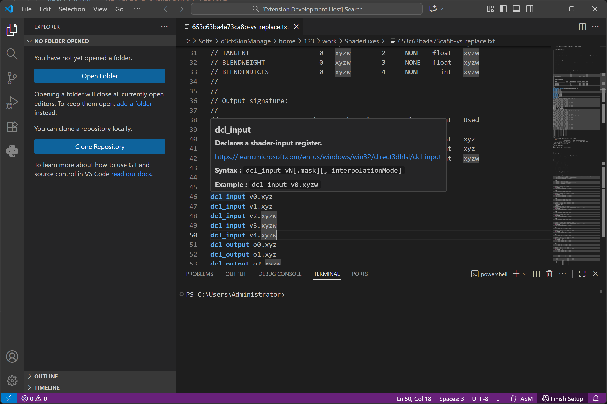

# sm-lang README

A VSCode Plugin which offers syntax support for DirectX Assembly Shader Model 4 & 5.

It's designed for easier analyse 3Dmigoto dumped shader txt files(some of them is over 4000 lines with even over 20 layers if-else-endif sturcture merged together and very horrible to analyse if without syntax highlight, for example: MechaBreak's shader), this VSCode Plugin also contains some special syntax only defined in 3Dmigoto source code.

# Still Under Development & Test

I have no idea how vscode plugin works and start try this from 0, so i code this plugin with the help of DeepSeek. 

This plugin is still under development and test, It's not ready for use unless some day a release version is published.

# Usage
Basic usage offers a tip for function name to remind you what it is and offers a link directly to the documents.

