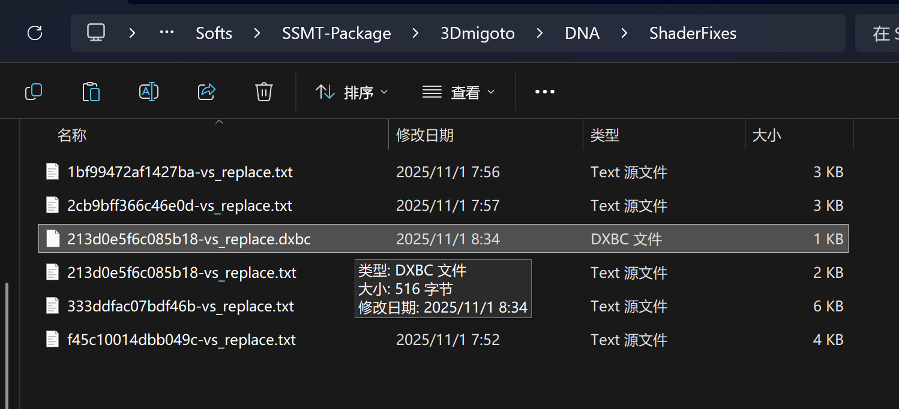
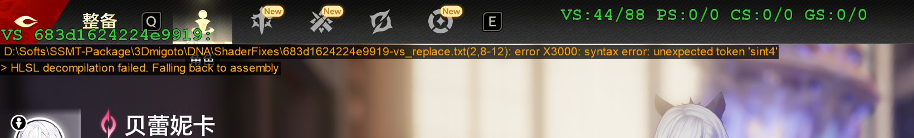

# Useful Links

https://learn.microsoft.com/en-us/windows/win32/direct3dhlsl/dx-graphics-hlsl-sm4-asm

https://learn.microsoft.com/en-us/windows/win32/direct3dhlsl/shader-model-5-assembly--directx-hlsl-

For DirectX ,they secretly hide a more deep documents here almost no one knows:
https://microsoft.github.io/DirectX-Specs/

And they hide old things in archive, which is more close to 3Dmigoto:
https://microsoft.github.io/DirectX-Specs/d3d/archive/D3D11_3_FunctionalSpec.htm

original repo:
https://github.com/microsoft/DirectX-Specs/tree/master

Dig Deeper:
https://github.com/microsoft/DirectXShaderCompiler


# Almost no documents for some thing like 'ld_indexable'

It seems it's just suddenly appear and be used everywhere but no one explain what it is.

almost everything is undocumented.

have to go everywhere on github to try find the clue.

And just find these:
https://github.com/spacehamster/DXDecompiler

the question is : why they stop update some thing like parse original binary code to hlsl?

then just find that :

dxilconv.dll, a DLL providing a converter from DXBC (older shader bytecode format)

in https://github.com/microsoft/DirectXShaderCompiler

now only DX11 use DXBC, DX12 prefer to use DXIL but compatible with DXBC(max to SM5.1).


# HLSL to DXBC, DXBC to HLSL, DXBC to DXIL to HLSL, HLSL to DXIL to DXBC

3dmigoto can parse DXBC to HLSL but not support for some features so always get a flawed HLSL,

RenderDoc may use both 3Dmigoto and HLSL-Decompiler's code to decompile DXBC.

https://github.com/YYadorigi/HLSL-Decompiler

I think the DecompileHLSL.cpp in 3Dmigoto is not reliable in some case, will try to dump as bin and decompile it with YYadorigi's HLSL-Decompiler, so the question comes, can 3Dmigoto correctly translate SM5.1 HLSL to DXBC?

I have seen SpectrumQT use d3dcompiler47.dll in WWMI project, is this means the old d3dcompiler46.dll is not enough in moredn UE5 games?

Or is that means 3Dmigoto is limited in these parts? I'm lazy to test.

I don't know, it maybe doesn't matter, but in case this information is useful in future, write it down here.

And if YYadorigi's HLSL-Decompiler can works perfect ,is this project even worth to be exists ???

But here comes the problem,3Dmigoto can't dump binary format shader AKA DXBC to ShaderFixes when marking action triggered.

It always convert it to ASM text or HLSL text, We can find this behaviour at Hunting.cpp:

```cpp
static void MarkShaderEnd(HackerDevice *device, char *long_type, char *short_type, UINT64 selected)
{
	// Clears any notices currently displayed on the overlay. This ensures
	// that any notices that haven't timed out yet (e.g. from a previous
	// failed dump attempt) are removed so that the only messages
	// displayed will be relevant to the current dump attempt.
	ClearNotices();

	if (G->marking_actions & MarkingAction::CLIPBOARD)
		HashToClipboard(long_type, selected);

	MarkingScreenShots(device, selected, short_type);

	// We always test if a shader is already dumped even if neither HLSL or
	// asm dumping is enabled, as this provides useful feedback on the
	// overlay and touches the shader timestamp if it exists:
	if (!shader_already_dumped(selected, short_type)) {
		if (G->marking_actions & MarkingAction::DUMP_MASK) {
			// Copy marked shader to ShaderFixes
			CopyToFixes(selected, device);
		}
	}

	if (G->DumpUsage)
		DumpUsage(NULL);

	LeaveCriticalSection(&G->mCriticalSection);
}


// When a shader is marked by the user, we want to automatically move it to the ShaderFixes folder
// The universal way to do this is to keep the shaderByteCode around, and when mark happens, use that as
// the replacement and build code to match.  This handles all the variants of preload, cache, hlsl 
// or not, and allows creating new files on a first run.  Should be handy.

static void CopyToFixes(UINT64 hash, HackerDevice *device)
{
	bool success = false;
	bool asm_enabled = !!(G->marking_actions & MarkingAction::ASM);
	string asmText, hlslText, errText;

	// The key of the map is the actual shader, we thus need to do a linear search to find our marked hash.
	for each (pair<ID3D11DeviceChild *, OriginalShaderInfo> iter in G->mReloadedShaders)
	{
		if (iter.second.hash == hash)
		{
			if (G->marking_actions & MarkingAction::REGEX) {
				// We don't have the patched assembly saved anywhere, and even if we did save it
				// off while applying ShaderRegex that would only work when not loading from cache.
				// We can't really use the ShaderRegex bytecode either because that will be missing
				// RDEF making it not all that useful to look at. Instead we will disassemble the
				// original shader now (with RDEF assuming the game didn't strip that), run
				// ShaderRegex and output that.
				asmText = BinaryToAsmText(iter.second.byteCode->GetBufferPointer(), iter.second.byteCode->GetBufferSize(), G->patch_cb_offsets);
				if (asmText.empty())
					break;
				wstring tagline(L"// MANUALLY DUMPED ");
				bool patched = false;
				try {
					patched = apply_shader_regex_groups(&asmText, iter.second.shaderType.c_str(), &iter.second.shaderModel, hash, &tagline);
				} catch (...) {
					LogOverlay(LOG_WARNING, "Exception while patching shader\n");
				}

				if (patched) {
					success = WriteASM(&asmText, NULL, NULL, hash, iter.second, device, &tagline);
					break;
				}
			}

			if (G->marking_actions & MarkingAction::HLSL) {
				// TODO: Allow the decompiler to parse the patched CB offsets
				// and move this line back to the common code path:
				asmText = BinaryToAsmText(iter.second.byteCode->GetBufferPointer(), iter.second.byteCode->GetBufferSize(), false);
				if (asmText.empty())
					break;

				// Save the decompiled text, and ASM text into the HLSL .txt source file:
				success = WriteHLSL(&asmText, &hlslText, &errText, hash, iter.second, device, asm_enabled);
				if (success)
					break;
				else if (asm_enabled)
					LogOverlay(LOG_NOTICE, "> HLSL decompilation failed. Falling back to assembly\n");
			}

			if (asm_enabled) {
				asmText = BinaryToAsmText(iter.second.byteCode->GetBufferPointer(), iter.second.byteCode->GetBufferSize(), G->patch_cb_offsets);
				if (asmText.empty())
					break;

				success = WriteASM(&asmText, &hlslText, &errText, hash, iter.second, device);
				break;
			}

			if (success) {
				// ShaderRegex may have also altered the ShaderOverride, but now we've dumped it
				// out this would not be processed on the next config reload, so revert the
				// changes to the ShaderOverride to ensure things are consistent:
				if (unlink_shader_regex_command_lists_and_filter_index(hash))
					LogOverlay(LOG_WARNING, "NOTICE: ShaderRegex command lists were dropped from the ShaderOverride\n");
			}

			// There can be more than one in the map with the same hash, but we only need a single copy to
			// make the hlsl file output, so exit with success.
			break;
		}
	}

	if (success)
	{
		LogOverlay(LOG_INFO, "> successfully copied Marked shader to ShaderFixes\n");
	}
	else
	{
		LogOverlay(LOG_WARNING, "> FAILED to copy Marked shader to ShaderFixes\n");
		BeepFailure();
	}
}

```

So to test with HLSLDecompiler, we first need to add a marking action that can directly dump shader to .bin(or .dxbc is better?) into ShaderFixes folder, so we can precisely get a shader's binary DXBC format file.


we add some code here:
```cpp

// When a shader is marked by the user, we want to automatically move it to the ShaderFixes folder
// The universal way to do this is to keep the shaderByteCode around, and when mark happens, use that as
// the replacement and build code to match.  This handles all the variants of preload, cache, hlsl 
// or not, and allows creating new files on a first run.  Should be handy.

static void CopyToFixes(UINT64 hash, HackerDevice *device)
{
	bool success = false;
	bool asm_enabled = !!(G->marking_actions & MarkingAction::ASM);
	string asmText, hlslText, errText;

	// The key of the map is the actual shader, we thus need to do a linear search to find our marked hash.
	for each (pair<ID3D11DeviceChild *, OriginalShaderInfo> iter in G->mReloadedShaders)
	{
		if (iter.second.hash == hash)
		{
			//We always need a original .dxbc file.
			size_t BytecodeLength = iter.second.byteCode->GetBufferSize();
			vector<byte> byteCode(BytecodeLength);
			memcpy(byteCode.data(), iter.second.byteCode->GetBufferPointer(), BytecodeLength);

			//Directly Write To ShaderFixes folder as .dxbc file.
			wchar_t fileName[MAX_PATH];
			wchar_t fullName[MAX_PATH];
			swprintf_s(fileName, MAX_PATH, L"%016llx-%ls_replace.dxbc", hash, iter.second.shaderType.c_str());
			swprintf_s(fullName, MAX_PATH, L"%ls\\%ls", G->SHADER_PATH, fileName);
			// 2. 写二进制文件
			// 2. 创建文件并写入
			HANDLE hFile = CreateFileW(fullName,
				GENERIC_WRITE,
				0,                       // 不共享
				nullptr,                 // 默认安全属性
				CREATE_ALWAYS,           // 覆盖写
				FILE_ATTRIBUTE_NORMAL,
				nullptr);
			if (hFile == INVALID_HANDLE_VALUE)
			{
				// 可选：记录日志
				LogOverlay(LOG_WARNING, "3DMigoto: 无法创建 dxbc 文件 %ls, gle=%lu\n",
					fullName, GetLastError());
			}
			else
			{
				DWORD written = 0;
				BOOL ok = WriteFile(hFile,
					byteCode.data(),          // vector<byte> 原始数据
					static_cast<DWORD>(byteCode.size()),
					&written,
					nullptr);                 // 同步写
				if (!ok || written != byteCode.size())
				{
					LogOverlay(LOG_WARNING, "3DMigoto: 写入 dxbc 文件失败, gle=%lu\n",
						GetLastError());
				}
				CloseHandle(hFile);
			}


			if (G->marking_actions & MarkingAction::REGEX) {
				// We don't have the patched assembly saved anywhere, and even if we did save it
				// off while applying ShaderRegex that would only work when not loading from cache.
				// We can't really use the ShaderRegex bytecode either because that will be missing
				// RDEF making it not all that useful to look at. Instead we will disassemble the
				// original shader now (with RDEF assuming the game didn't strip that), run
				// ShaderRegex and output that.
				asmText = BinaryToAsmText(iter.second.byteCode->GetBufferPointer(), iter.second.byteCode->GetBufferSize(), G->patch_cb_offsets);
				if (asmText.empty())
					break;
				wstring tagline(L"// MANUALLY DUMPED ");
				bool patched = false;
				try {
					patched = apply_shader_regex_groups(&asmText, iter.second.shaderType.c_str(), &iter.second.shaderModel, hash, &tagline);
				} catch (...) {
					LogOverlay(LOG_WARNING, "Exception while patching shader\n");
				}

				if (patched) {
					success = WriteASM(&asmText, NULL, NULL, hash, iter.second, device, &tagline);
					break;
				}
			}

			if (G->marking_actions & MarkingAction::HLSL) {
				// TODO: Allow the decompiler to parse the patched CB offsets
				// and move this line back to the common code path:
				asmText = BinaryToAsmText(iter.second.byteCode->GetBufferPointer(), iter.second.byteCode->GetBufferSize(), false);
				if (asmText.empty())
					break;

				// Save the decompiled text, and ASM text into the HLSL .txt source file:
				success = WriteHLSL(&asmText, &hlslText, &errText, hash, iter.second, device, asm_enabled);
				if (success)
					break;
				else if (asm_enabled)
					LogOverlay(LOG_NOTICE, "> HLSL decompilation failed. Falling back to assembly\n");
			}

			if (asm_enabled) {
				asmText = BinaryToAsmText(iter.second.byteCode->GetBufferPointer(), iter.second.byteCode->GetBufferSize(), G->patch_cb_offsets);
				if (asmText.empty())
					break;

				success = WriteASM(&asmText, &hlslText, &errText, hash, iter.second, device);
				break;
			}

			if (success) {
				// ShaderRegex may have also altered the ShaderOverride, but now we've dumped it
				// out this would not be processed on the next config reload, so revert the
				// changes to the ShaderOverride to ensure things are consistent:
				if (unlink_shader_regex_command_lists_and_filter_index(hash))
					LogOverlay(LOG_WARNING, "NOTICE: ShaderRegex command lists were dropped from the ShaderOverride\n");
			}

			// There can be more than one in the map with the same hash, but we only need a single copy to
			// make the hlsl file output, so exit with success.
			break;
		}
	}

	if (success)
	{
		LogOverlay(LOG_INFO, "> successfully copied Marked shader to ShaderFixes\n");
	}
	else
	{
		LogOverlay(LOG_WARNING, "> FAILED to copy Marked shader to ShaderFixes\n");
		BeepFailure();
	}
}
```
so everytime the marking action is triggered, a .dxbc file will be write so we can get the original binary format, so we can use it on HLSLDecompiler.exe by YYadorigi

I'm still curious about this, why 3dmigoto can't dump original shader to binary format and still publish a HLSLDecompiler.exe in their released .zip file? is it used for recompiled .bin format's reverse? or some thing elese?

Well, i don't care ,let's try what YYadorigi's HLSLDecompiler.exe can do.

Here we compile modified 3dmigoto and use it in game and then press numpad 6 to dump a vertex shader to test.



now we put it into HLSLDecompiler's folder:


and run code in powershell:

```
.\HLSLDecompiler.exe .\213d0e5f6c085b18-vs_replace.dxbc -dxbc
```


and it generate a .hlsl file here:


open it and we get a beautiful hlsl file:

```c
cbuffer CB0UBO : register(b0, space0)
{
    float4 CB0_m0[2] : packoffset(c0);
};


static float4 gl_Position;
static int gl_InstanceIndex;
static int gl_BaseInstanceARB;
cbuffer SPIRV_Cross_VertexInfo
{
    int SPIRV_Cross_BaseVertex;
    int SPIRV_Cross_BaseInstance;
};

static float2 ATTRIBUTE;
static float2 ATTRIBUTE_1;
static float2 TEXCOORD;
static uint TEXCOORD_1;

struct SPIRV_Cross_Input
{
    float2 ATTRIBUTE : TEXCOORD0;
    float2 ATTRIBUTE_1 : TEXCOORD1;
    uint gl_InstanceIndex : SV_InstanceID;
};

struct SPIRV_Cross_Output
{
    float2 TEXCOORD : TEXCOORD0;
    uint TEXCOORD_1 : TEXCOORD2;
    float4 gl_Position : SV_Position;
};

void vert_main()
{
    TEXCOORD.x = mad(ATTRIBUTE_1.x, CB0_m0[1u].x, CB0_m0[1u].z);
    TEXCOORD.y = mad(ATTRIBUTE_1.y, CB0_m0[1u].y, CB0_m0[1u].w);
    gl_Position.x = ATTRIBUTE.x;
    gl_Position.y = ATTRIBUTE.y;
    gl_Position.z = 0.0f;
    gl_Position.w = 1.0f;
    TEXCOORD_1 = (uint(gl_InstanceIndex) - uint(gl_BaseInstanceARB)) + asuint(CB0_m0[0u]).x;
}

SPIRV_Cross_Output main(SPIRV_Cross_Input stage_input)
{
    gl_InstanceIndex = int(stage_input.gl_InstanceIndex);
    gl_BaseInstanceARB = SPIRV_Cross_BaseInstance;
    ATTRIBUTE = stage_input.ATTRIBUTE;
    ATTRIBUTE_1 = stage_input.ATTRIBUTE_1;
    vert_main();
    SPIRV_Cross_Output stage_output;
    stage_output.gl_Position = gl_Position;
    stage_output.TEXCOORD = TEXCOORD;
    stage_output.TEXCOORD_1 = TEXCOORD_1;
    return stage_output;
}

```

And let's see original 3dmigoto parsed .hlsl:

```
// ---- Created with 3Dmigoto v1.3.16 on Sat Nov  1 07:57:23 2025
cbuffer cb0 : register(b0)
{
  float4 cb0[3];
}


// 3Dmigoto declarations
#define cmp -
Texture1D<float4> IniParams : register(t120);


void main(
  float4 v0 : ATTRIBUTE0,
  float2 v1 : ATTRIBUTE1,
  out float2 o0 : TEXCOORD0,
  out float4 o1 : SV_POSITION0)
{
  float4 r0;
  uint4 bitmask, uiDest;
  float4 fDest;

  r0.xy = v1.xy * cb0[1].xy + cb0[1].zw;
  o0.xy = cb0[2].zw * r0.xy;
  r0.xy = v0.xy * cb0[0].xy + cb0[0].zw;
  r0.xy = cb0[2].xy * r0.xy;
  r0.xy = r0.xy * float2(2,2) + float2(-1,-1);
  o1.xy = float2(1,-1) * r0.xy;
  o1.zw = v0.zw;
  return;
}

/*~~~~~~~~~~~~~~~~~~~~~~~~~~~~~~~~~~~~~~~~~~~~~~~~~~~~~~~~~~~~~~~~~~~~~~~~~~~
//
// Generated by Microsoft (R) D3D Shader Disassembler
//
//   using 3Dmigoto v1.3.16 on Sat Nov  1 07:57:23 2025
//
//
// Input signature:
//
// Name                 Index   Mask Register SysValue  Format   Used
// -------------------- ----- ------ -------- -------- ------- ------
// ATTRIBUTE                0   xyzw        0     NONE   float   xyzw
// ATTRIBUTE                1   xy          1     NONE   float   xy
//
//
// Output signature:
//
// Name                 Index   Mask Register SysValue  Format   Used
// -------------------- ----- ------ -------- -------- ------- ------
// TEXCOORD                 0   xy          0     NONE   float   xy
// SV_POSITION              0   xyzw        1      POS   float   xyzw
//
vs_5_0
dcl_globalFlags refactoringAllowed
dcl_constantbuffer CB0[3], immediateIndexed
dcl_input v0.xyzw
dcl_input v1.xy
dcl_output o0.xy
dcl_output_siv o1.xyzw, position
dcl_temps 1
mad r0.xy, v1.xyxx, cb0[1].xyxx, cb0[1].zwzz
mul o0.xy, r0.xyxx, cb0[2].zwzz
mad r0.xy, v0.xyxx, cb0[0].xyxx, cb0[0].zwzz
mul r0.xy, r0.xyxx, cb0[2].xyxx
mad r0.xy, r0.xyxx, l(2.000000, 2.000000, 0.000000, 0.000000), l(-1.000000, -1.000000, 0.000000, 0.000000)
mul o1.xy, r0.xyxx, l(1.000000, -1.000000, 0.000000, 0.000000)
mov o1.zw, v0.zzzw
ret
// Approximately 0 instruction slots used

//~~~~~~~~~~~~~~~~~~~~~~~~~~~~~~~~~~~~~~~~~~~~~~~~~~~~~~~~~~~~~~~~~~~~~~~~~*/


```

they both useful, so now let's test some special shader that 3Dmigoto can't parse and generate a flawed output.



3Dmigoto output:
```

//
// Generated by Microsoft (R) D3D Shader Disassembler
//
//   using 3Dmigoto v1.3.16 on Sat Nov  1 08:52:07 2025
//
//
// Input signature:
//
// Name                 Index   Mask Register SysValue  Format   Used
// -------------------- ----- ------ -------- -------- ------- ------
// ATTRIBUTE                0   xy          0     NONE   float   xy
// SV_VertexID              0   x           1   VERTID    uint   x
// SV_InstanceID            0   x           2   INSTID    uint   x
//
//
// Output signature:
//
// Name                 Index   Mask Register SysValue  Format   Used
// -------------------- ----- ------ -------- -------- ------- ------
// TEXCOORD                10   xyzw        0     NONE   float   xyzw
// TEXCOORD                11   xyzw        1     NONE   float   xyzw
// PARTICLE_DYNAMIC_PARAM     0   xyzw        2     NONE   float   xyzw
// PARTICLE_DYNAMIC_PARAM     2   xyzw        3     NONE   float   xyzw
// TEXCOORD                 0   xyzw        4     NONE   float   xyzw
// TEXCOORD                 1   xyzw        5     NONE   float   xyzw
// PARTICLE_VELOCITY        0   xyzw        6     NONE   float   xyzw
// TEXCOORD                 6   xyzw        7     NONE   float   xyzw
// SV_POSITION              0   xyzw        8      POS   float   xyzw
// SV_ClipDistance          0   x           9  CLIPDST   float   x
//
vs_5_0
dcl_globalFlags refactoringAllowed
dcl_constantbuffer CB0[139], immediateIndexed
dcl_constantbuffer CB1[5], immediateIndexed
dcl_constantbuffer CB2[2], immediateIndexed
dcl_constantbuffer CB3[33], immediateIndexed
dcl_resource_buffer (float,float,float,float) t0
dcl_resource_buffer (float,float,float,float) t1
dcl_resource_buffer (float,float,float,float) t2
dcl_resource_buffer (sint,sint,sint,sint) t3
dcl_input v0.xy
dcl_input_sgv v1.x, vertex_id
dcl_input_sgv v2.x, instance_id
dcl_output o0.xyzw
dcl_output o1.xyzw
dcl_output o2.xyzw
dcl_output o3.xyzw
dcl_output o4.xyzw
dcl_output o5.xyzw
dcl_output o6.xyzw
dcl_output o7.xyzw
dcl_output_siv o8.xyzw, position
dcl_output_siv o9.x, clip_distance
dcl_temps 25
ine r0.x, cb2[1].x, l(-1)
if_nz r0.x
  iadd r0.x, v2.x, cb2[1].x
  ld_indexable(buffer)(sint,sint,sint,sint) r0.x, r0.xxxx, t3.xyzw
else
  mov r0.x, v2.x
endif
ieq r0.yz, cb3[9].xxzx, l(0, -1, -1, 0)
if_nz r0.y
  mov r1.xyz, cb3[16].xyzx
endif
if_z r0.y
  and r0.yw, cb3[9].xxxx, l(0, 0x80000000, 0, 0x7fffffff)
  if_nz r0.y
    imad r0.y, r0.w, cb2[0].y, r0.x
    ld_indexable(buffer)(float,float,float,float) r1.x, r0.yyyy, t2.xyzw
    iadd r2.xy, r0.wwww, l(1, 2, 0, 0)
    imad r2.xy, r2.xyxx, cb2[0].yyyy, r0.xxxx
    ld_indexable(buffer)(float,float,float,float) r1.y, r2.xxxx, t2.yxzw
    ld_indexable(buffer)(float,float,float,float) r1.z, r2.yyyy, t2.yzxw
  else
    imad r0.y, r0.w, cb2[0].y, r0.x
    ld_indexable(buffer)(float,float,float,float) r1.x, r0.yyyy, t1.xyzw
    iadd r0.yw, r0.wwww, l(0, 1, 0, 2)
    imad r0.yw, r0.yyyw, cb2[0].yyyy, r0.xxxx
    ld_indexable(buffer)(float,float,float,float) r1.y, r0.yyyy, t1.yxzw
    ld_indexable(buffer)(float,float,float,float) r1.z, r0.wwww, t1.yzxw
  endif
endif
mul r2.xyz, r1.yyyy, cb1[1].xyzx
mad r2.xyz, cb1[0].xyzx, r1.xxxx, r2.xyzx
mad r2.xyz, cb1[2].xyzx, r1.zzzz, r2.xyzx
add r2.xyz, r2.xyzx, cb1[3].xyzx
movc r1.xyz, cb3[0].xxxx, r2.xyzx, r1.xyzx
ieq r0.yw, cb3[10].xxxz, l(0, -1, 0, -1)
if_nz r0.y
  mov r1.w, cb3[21].w
endif
if_z r0.y
  and r2.xy, cb3[10].xxxx, l(0x80000000, 0x7fffffff, 0, 0)
  if_nz r2.x
    imad r0.y, r2.y, cb2[0].y, r0.x
    ld_indexable(buffer)(float,float,float,float) r1.w, r0.yyyy, t2.yzwx
  else
    imad r0.y, r2.y, cb2[0].y, r0.x
    ld_indexable(buffer)(float,float,float,float) r1.w, r0.yyyy, t1.yzwx
  endif
endif
mul r0.y, r1.w, cb3[7].x
if_nz r0.w
  mov r2.xy, cb3[18].xyxx
endif
if_z r0.w
  and r2.zw, cb3[10].zzzz, l(0, 0, 0x80000000, 0x7fffffff)
  if_nz r2.z
    imad r0.w, r2.w, cb2[0].y, r0.x
    ld_indexable(buffer)(float,float,float,float) r2.x, r0.wwww, t2.xyzw
    iadd r0.w, r2.w, l(1)
    imad r0.w, r0.w, cb2[0].y, r0.x
    ld_indexable(buffer)(float,float,float,float) r2.y, r0.wwww, t2.yxzw
  else
    imad r0.w, r2.w, cb2[0].y, r0.x
    ld_indexable(buffer)(float,float,float,float) r2.x, r0.wwww, t1.xyzw
    iadd r0.w, r2.w, l(1)
    imad r0.w, r0.w, cb2[0].y, r0.x
    ld_indexable(buffer)(float,float,float,float) r2.y, r0.wwww, t1.yxzw
  endif
endif
if_nz r0.z
  mov r3.xyz, cb3[20].xyzx
endif
if_z r0.z
  and r0.zw, cb3[9].zzzz, l(0, 0, 0x80000000, 0x7fffffff)
  if_nz r0.z
    imad r0.z, r0.w, cb2[0].y, r0.x
    ld_indexable(buffer)(float,float,float,float) r3.x, r0.zzzz, t2.xyzw
    iadd r2.zw, r0.wwww, l(0, 0, 1, 2)
    imad r2.zw, r2.zzzw, cb2[0].yyyy, r0.xxxx
    ld_indexable(buffer)(float,float,float,float) r3.y, r2.zzzz, t2.yxzw
    ld_indexable(buffer)(float,float,float,float) r3.z, r2.wwww, t2.yzxw
  else
    imad r0.z, r0.w, cb2[0].y, r0.x
    ld_indexable(buffer)(float,float,float,float) r3.x, r0.zzzz, t1.xyzw
    iadd r0.zw, r0.wwww, l(0, 0, 1, 2)
    imad r0.zw, r0.zzzw, cb2[0].yyyy, r0.xxxx
    ld_indexable(buffer)(float,float,float,float) r3.y, r0.zzzz, t1.yxzw
    ld_indexable(buffer)(float,float,float,float) r3.z, r0.wwww, t1.yzxw
  endif
endif
mul r4.xyz, cb1[0].xyzx, cb1[4].xxxx
mul r5.xyz, cb1[1].xyzx, cb1[4].yyyy
mul r6.xyz, r3.yyyy, r5.xyzx
mad r6.xyz, r4.xyzx, r3.xxxx, r6.xyzx
mul r7.xyz, cb1[2].xyzx, cb1[4].zzzz
mad r6.xyz, r7.xyzx, r3.zzzz, r6.xyzx
movc r3.xyz, cb3[0].xxxx, r6.xyzx, r3.xyzx
ieq r6.xyz, cb3[11].xywx, l(-1, -1, -1, 0)
if_nz r6.x
  mov r0.z, cb3[25].x
endif
if_z r6.x
  and r2.zw, cb3[11].xxxx, l(0, 0, 0x80000000, 0x7fffffff)
  if_nz r2.z
    imad r0.w, r2.w, cb2[0].y, r0.x
    ld_indexable(buffer)(float,float,float,float) r0.z, r0.wwww, t2.yzxw
  else
    imad r0.w, r2.w, cb2[0].y, r0.x
    ld_indexable(buffer)(float,float,float,float) r0.z, r0.wwww, t1.yzxw
  endif
endif
ieq r2.zw, cb3[12].wwwy, l(0, 0, -1, -1)
if_nz r2.z
  mov r8.xyz, cb3[26].xyzx
endif
if_z r2.z
  and r6.xw, cb3[12].wwww, l(0x80000000, 0, 0, 0x7fffffff)
  if_nz r6.x
    imad r0.w, r6.w, cb2[0].y, r0.x
    ld_indexable(buffer)(float,float,float,float) r8.x, r0.wwww, t2.xyzw
    iadd r9.xy, r6.wwww, l(1, 2, 0, 0)
    imad r9.xy, r9.xyxx, cb2[0].yyyy, r0.xxxx
    ld_indexable(buffer)(float,float,float,float) r8.y, r9.xxxx, t2.yxzw
    ld_indexable(buffer)(float,float,float,float) r8.z, r9.yyyy, t2.yzxw
  else
    imad r0.w, r6.w, cb2[0].y, r0.x
    ld_indexable(buffer)(float,float,float,float) r8.x, r0.wwww, t1.xyzw
    iadd r6.xw, r6.wwww, l(1, 0, 0, 2)
    imad r6.xw, r6.xxxw, cb2[0].yyyy, r0.xxxx
    ld_indexable(buffer)(float,float,float,float) r8.y, r6.xxxx, t1.yxzw
    ld_indexable(buffer)(float,float,float,float) r8.z, r6.wwww, t1.yzxw
  endif
endif
mul r9.xyz, r5.zxyz, r8.yyyy
mad r9.xyz, r4.zxyz, r8.xxxx, r9.xyzx
mad r9.xyz, r7.zxyz, r8.zzzz, r9.xyzx
movc r8.xyz, cb3[0].xxxx, r9.xyzx, r8.zxyz
dp3 r0.w, r8.xyzx, r8.xyzx
sqrt r0.w, r0.w
max r0.w, r0.w, l(0.000001)
div r8.xyz, r8.xyzx, r0.wwww
ieq r6.xw, cb3[13].yyyw, l(-1, 0, 0, 1)
if_nz r6.x
  mov r9.xyz, cb3[28].xyzx
endif
if_z r6.x
  and r10.xy, cb3[13].yyyy, l(0x80000000, 0x7fffffff, 0, 0)
  if_nz r10.x
    imad r0.w, r10.y, cb2[0].y, r0.x
    ld_indexable(buffer)(float,float,float,float) r9.x, r0.wwww, t2.xyzw
    iadd r10.xz, r10.yyyy, l(1, 0, 2, 0)
    imad r10.xz, r10.xxzx, cb2[0].yyyy, r0.xxxx
    ld_indexable(buffer)(float,float,float,float) r9.y, r10.xxxx, t2.yxzw
    ld_indexable(buffer)(float,float,float,float) r9.z, r10.zzzz, t2.yzxw
  else
    imad r0.w, r10.y, cb2[0].y, r0.x
    ld_indexable(buffer)(float,float,float,float) r9.x, r0.wwww, t1.xyzw
    iadd r10.xy, r10.yyyy, l(1, 2, 0, 0)
    imad r10.xy, r10.xyxx, cb2[0].yyyy, r0.xxxx
    ld_indexable(buffer)(float,float,float,float) r9.y, r10.xxxx, t1.yxzw
    ld_indexable(buffer)(float,float,float,float) r9.z, r10.yyyy, t1.yzxw
  endif
endif
ieq r10.xyz, cb3[14].wzxw, l(-1, -1, -1, 0)
if_nz r10.x
  mov r11.xy, cb3[8].xyxx
endif
if_z r10.x
  and r10.xw, cb3[14].wwww, l(0x80000000, 0, 0, 0x7fffffff)
  if_nz r10.x
    imad r0.w, r10.w, cb2[0].y, r0.x
    ld_indexable(buffer)(float,float,float,float) r11.x, r0.wwww, t2.xyzw
    iadd r0.w, r10.w, l(1)
    imad r0.w, r0.w, cb2[0].y, r0.x
    ld_indexable(buffer)(float,float,float,float) r11.y, r0.wwww, t2.yxzw
  else
    imad r0.w, r10.w, cb2[0].y, r0.x
    ld_indexable(buffer)(float,float,float,float) r11.x, r0.wwww, t1.xyzw
    iadd r0.w, r10.w, l(1)
    imad r0.w, r0.w, cb2[0].y, r0.x
    ld_indexable(buffer)(float,float,float,float) r11.y, r0.wwww, t1.yxzw
  endif
endif
if_nz r10.y
  mov r10.xw, cb3[19].xxxy
endif
if_z r10.y
  and r11.zw, cb3[14].zzzz, l(0, 0, 0x80000000, 0x7fffffff)
  if_nz r11.z
    imad r0.w, r11.w, cb2[0].y, r0.x
    ld_indexable(buffer)(float,float,float,float) r10.x, r0.wwww, t2.xzwy
    iadd r0.w, r11.w, l(1)
    imad r0.w, r0.w, cb2[0].y, r0.x
    ld_indexable(buffer)(float,float,float,float) r10.w, r0.wwww, t2.yzwx
  else
    imad r0.w, r11.w, cb2[0].y, r0.x
    ld_indexable(buffer)(float,float,float,float) r10.x, r0.wwww, t1.xzwy
    iadd r0.w, r11.w, l(1)
    imad r0.w, r0.w, cb2[0].y, r0.x
    ld_indexable(buffer)(float,float,float,float) r10.w, r0.wwww, t1.yzwx
  endif
endif
add r12.xyz, -r1.zxyz, cb0[67].zxyz
dp3 r0.w, r12.xyzx, r12.xyzx
sqrt r1.w, r0.w
max r2.z, r1.w, l(0.000001)
div r12.xyz, r12.xyzx, r2.zzzz
if_nz r10.z
  mov r2.z, cb3[24].y
endif
if_z r10.z
  and r10.yz, cb3[14].xxxx, l(0, 0x80000000, 0x7fffffff, 0)
  if_nz r10.y
    imad r3.w, r10.z, cb2[0].y, r0.x
    ld_indexable(buffer)(float,float,float,float) r2.z, r3.wwww, t2.yzxw
  else
    imad r3.w, r10.z, cb2[0].y, r0.x
    ld_indexable(buffer)(float,float,float,float) r2.z, r3.wwww, t1.yzxw
  endif
endif
ne r3.w, cb3[22].y, l(0.000000)
mul r1.w, r1.w, cb3[22].y
mul r1.w, r1.w, cb0[138].z
div r1.w, r1.w, cb0[28].x
max r10.yz, r2.xxyx, r1.wwww
movc r2.xy, r3.wwww, r10.yzyy, r2.xyxx
if_nz r6.y
  mov o4.xyzw, cb3[23].xyzw
endif
if_z r6.y
  and r10.yz, cb3[11].yyyy, l(0, 0x80000000, 0x7fffffff, 0)
  if_nz r10.y
    imad r1.w, r10.z, cb2[0].y, r0.x
    ld_indexable(buffer)(float,float,float,float) r1.w, r1.wwww, t2.yzwx
    iadd r13.xyz, r10.zzzz, l(1, 2, 3, 0)
    imad r13.xyz, r13.xyzx, cb2[0].yyyy, r0.xxxx
    ld_indexable(buffer)(float,float,float,float) r3.w, r13.xxxx, t2.yzwx
    ld_indexable(buffer)(float,float,float,float) r4.w, r13.yyyy, t2.yzwx
    ld_indexable(buffer)(float,float,float,float) r5.w, r13.zzzz, t2.yzwx
    mov o4.x, r1.w
    mov o4.y, r3.w
    mov o4.z, r4.w
    mov o4.w, r5.w
  else
    imad r1.w, r10.z, cb2[0].y, r0.x
    ld_indexable(buffer)(float,float,float,float) r1.w, r1.wwww, t1.yzwx
    iadd r13.xyz, r10.zzzz, l(1, 2, 3, 0)
    imad r13.xyz, r13.xyzx, cb2[0].yyyy, r0.xxxx
    ld_indexable(buffer)(float,float,float,float) r3.w, r13.xxxx, t1.yzwx
    ld_indexable(buffer)(float,float,float,float) r4.w, r13.yyyy, t1.yzwx
    ld_indexable(buffer)(float,float,float,float) r5.w, r13.zzzz, t1.yzwx
    mov o4.x, r1.w
    mov o4.y, r3.w
    mov o4.z, r4.w
    mov o4.w, r5.w
  endif
endif
if_nz r6.x
  mov r13.xyz, cb3[28].xyzx
endif
if_z r6.x
  and r6.xy, cb3[13].yyyy, l(0x80000000, 0x7fffffff, 0, 0)
  if_nz r6.x
    imad r1.w, r6.y, cb2[0].y, r0.x
    ld_indexable(buffer)(float,float,float,float) r13.x, r1.wwww, t2.xyzw
    iadd r10.yz, r6.yyyy, l(0, 1, 2, 0)
    imad r10.yz, r10.yyzy, cb2[0].yyyy, r0.xxxx
    ld_indexable(buffer)(float,float,float,float) r13.y, r10.yyyy, t2.yxzw
    ld_indexable(buffer)(float,float,float,float) r13.z, r10.zzzz, t2.yzxw
  else
    imad r1.w, r6.y, cb2[0].y, r0.x
    ld_indexable(buffer)(float,float,float,float) r13.x, r1.wwww, t1.xyzw
    iadd r6.xy, r6.yyyy, l(1, 2, 0, 0)
    imad r6.xy, r6.xyxx, cb2[0].yyyy, r0.xxxx
    ld_indexable(buffer)(float,float,float,float) r13.y, r6.xxxx, t1.yxzw
    ld_indexable(buffer)(float,float,float,float) r13.z, r6.yyyy, t1.yzxw
  endif
endif
mul r14.xyz, r5.xyzx, r13.yyyy
mad r14.xyz, r4.xyzx, r13.xxxx, r14.xyzx
mad r14.xyz, r7.xyzx, r13.zzzz, r14.xyzx
movc r13.xyz, cb3[0].xxxx, r14.xyzx, r13.xyzx
dp3 r1.w, r13.xyzx, r13.xyzx
sqrt r1.w, r1.w
max r1.w, r1.w, l(0.000001)
div r13.xyz, r13.xyzx, r1.wwww
if_nz r6.z
  mov o2.xyzw, cb3[30].xyzw
endif
if_z r6.z
  and r6.xy, cb3[11].wwww, l(0x80000000, 0x7fffffff, 0, 0)
  if_nz r6.x
    imad r1.w, r6.y, cb2[0].y, r0.x
    ld_indexable(buffer)(float,float,float,float) r1.w, r1.wwww, t2.yzwx
    iadd r14.xyz, r6.yyyy, l(1, 2, 3, 0)
    imad r14.xyz, r14.xyzx, cb2[0].yyyy, r0.xxxx
    ld_indexable(buffer)(float,float,float,float) r3.w, r14.xxxx, t2.yzwx
    ld_indexable(buffer)(float,float,float,float) r4.w, r14.yyyy, t2.yzwx
    ld_indexable(buffer)(float,float,float,float) r5.w, r14.zzzz, t2.yzwx
    mov o2.x, r1.w
    mov o2.y, r3.w
    mov o2.z, r4.w
    mov o2.w, r5.w
  else
    imad r1.w, r6.y, cb2[0].y, r0.x
    ld_indexable(buffer)(float,float,float,float) r1.w, r1.wwww, t1.yzwx
    iadd r6.xyz, r6.yyyy, l(1, 2, 3, 0)
    imad r6.xyz, r6.xyzx, cb2[0].yyyy, r0.xxxx
    ld_indexable(buffer)(float,float,float,float) r3.w, r6.xxxx, t1.yzwx
    ld_indexable(buffer)(float,float,float,float) r4.w, r6.yyyy, t1.yzwx
    ld_indexable(buffer)(float,float,float,float) r5.w, r6.zzzz, t1.yzwx
    mov o2.x, r1.w
    mov o2.y, r3.w
    mov o2.z, r4.w
    mov o2.w, r5.w
  endif
endif
if_nz r2.w
  mov o3.xyzw, cb3[32].xyzw
endif
if_z r2.w
  and r6.xy, cb3[12].yyyy, l(0x80000000, 0x7fffffff, 0, 0)
  if_nz r6.x
    imad r1.w, r6.y, cb2[0].y, r0.x
    ld_indexable(buffer)(float,float,float,float) r1.w, r1.wwww, t2.yzwx
    iadd r14.xyz, r6.yyyy, l(1, 2, 3, 0)
    imad r14.xyz, r14.xyzx, cb2[0].yyyy, r0.xxxx
    ld_indexable(buffer)(float,float,float,float) r2.w, r14.xxxx, t2.yzwx
    ld_indexable(buffer)(float,float,float,float) r3.w, r14.yyyy, t2.yzwx
    ld_indexable(buffer)(float,float,float,float) r4.w, r14.zzzz, t2.yzwx
    mov o3.x, r1.w
    mov o3.y, r2.w
    mov o3.z, r3.w
    mov o3.w, r4.w
  else
    imad r1.w, r6.y, cb2[0].y, r0.x
    ld_indexable(buffer)(float,float,float,float) r1.w, r1.wwww, t1.yzwx
    iadd r6.xyz, r6.yyyy, l(1, 2, 3, 0)
    imad r6.xyz, r6.xyzx, cb2[0].yyyy, r0.xxxx
    ld_indexable(buffer)(float,float,float,float) r0.x, r6.xxxx, t1.xyzw
    ld_indexable(buffer)(float,float,float,float) r2.w, r6.yyyy, t1.yzwx
    ld_indexable(buffer)(float,float,float,float) r3.w, r6.zzzz, t1.yzwx
    mov o3.x, r1.w
    mov o3.y, r0.x
    mov o3.z, r2.w
    mov o3.w, r3.w
  endif
endif
ieq r6.xy, cb2[0].wzww, l(2, 2, 0, 0)
movc r8.xyz, r6.xxxx, r8.xyzx, r12.xyzx
if_z cb2[0].z
  add r14.xyz, -cb0[62].xyzx, cb0[64].xyzx
  mad r14.xyz, cb3[5].wwww, r14.xyzx, cb0[62].xyzx
  add r15.xyz, -cb0[61].yzxy, cb0[63].yzxy
  mad r15.xyz, cb3[5].wwww, r15.xyzx, cb0[61].yzxy
  mul r16.xyz, r15.xyzx, -cb0[60].zxyz
  mad r16.xyz, -cb0[60].yzxy, r15.yzxy, -r16.xyzx
  dp3 r0.x, r16.xyzx, r16.xyzx
  sqrt r0.x, r0.x
  max r0.x, r0.x, l(0.000001)
  div r16.xyz, r16.xyzx, r0.xxxx
  mul r17.xyz, r16.yzxy, -cb0[60].zxyz
  mad r17.xyz, -cb0[60].yzxy, r16.zxyz, -r17.xyzx
  mul r18.xyz, r8.xyzx, r15.xyzx
  mad r18.xyz, r8.zxyz, r15.yzxy, -r18.xyzx
  dp3 r0.x, r18.xyzx, r18.xyzx
  sqrt r0.x, r0.x
  max r0.x, r0.x, l(0.000001)
  div r18.xyz, r18.xyzx, r0.xxxx
  mul r19.xyz, r8.xyzx, r18.yzxy
  mad r19.xyz, r8.zxyz, r18.zxyz, -r19.xyzx
  mul r20.xyz, r12.xyzx, l(0.000000, 1.000000, 0.000000, 0.000000)
  mad r20.xyz, r12.zxyz, l(1.000000, 0.000000, 0.000000, 0.000000), -r20.xyzx
  dp2 r0.x, r20.xyxx, r20.xyxx
  sqrt r0.x, r0.x
  max r0.x, r0.x, l(0.000001)
  div r21.xyz, r20.xyzx, r0.xxxx
  mul r22.xyz, r12.xyzx, r21.yzxy
  mad r22.xyz, r12.zxyz, r21.zxyz, -r22.xyzx
  mad_sat r0.x, r0.w, cb3[5].y, -cb3[5].z
  mul r23.xyz, r12.xyzx, r20.yzxy
  mad r23.xyz, r12.zxyz, r20.zxyz, -r23.xyzx
  add r24.xyz, r14.xyzx, -r20.xyzx
  mad r20.xyz, r0.xxxx, r24.xyzx, r20.xyzx
  add r24.xyz, -r15.zxyz, -r23.xyzx
  mad r23.xyz, r0.xxxx, r24.xyzx, r23.xyzx
  ieq r0.xw, cb2[0].wwww, l(4, 0, 0, 1)
  movc r18.xyz, r6.xxxx, r18.xyzx, r21.xyzx
  movc r19.xyz, r6.xxxx, r19.xyzx, r22.xyzx
  movc r16.xyz, r0.wwww, r16.xyzx, r18.xyzx
  movc r17.xyz, r0.wwww, r17.xyzx, r19.xyzx
  movc r14.xyz, cb2[0].wwww, r16.xyzx, r14.xyzx
  movc r15.xyz, cb2[0].wwww, r17.xyzx, -r15.zxyz
  movc r14.xyz, r0.xxxx, r20.xyzx, r14.xyzx
  movc r15.xyz, r0.xxxx, r23.xyzx, r15.xyzx
else
  mul r5.xyz, r5.xyzx, r9.yyyy
  mad r4.xyz, r4.xyzx, r9.xxxx, r5.xyzx
  mad r4.xyz, r7.xyzx, r9.zzzz, r4.xyzx
  movc r4.xyz, cb3[0].xxxx, r4.xyzx, r9.xyzx
  dp3 r0.x, r4.xyzx, r4.xyzx
  sqrt r0.x, r0.x
  max r0.x, r0.x, l(0.000001)
  div r4.xyz, r4.xyzx, r0.xxxx
  dp3 r0.x, r3.xyzx, r3.xyzx
  sqrt r0.x, r0.x
  lt r0.w, l(0.000001), r0.x
  div r5.xyz, r3.xyzx, r0.xxxx
  movc r5.xyz, r0.wwww, r5.xyzx, l(0,0,1.000000,0)
  and r0.xw, r6.yyyx, l(0x3f800000, 0, 0, 0x3f800000)
  add r4.xyz, r4.xyzx, -r5.xyzx
  mad r4.xyz, r0.xxxx, r4.xyzx, r5.xyzx
  mul r5.xyz, r4.yzxy, r8.xyzx
  mad r5.xyz, r8.zxyz, r4.zxyz, -r5.xyzx
  dp3 r0.x, r5.xyzx, r5.xyzx
  sqrt r0.x, r0.x
  max r0.x, r0.x, l(0.000001)
  div r14.xyz, r5.xyzx, r0.xxxx
  mul r5.xyz, r8.xyzx, r14.yzxy
  mad r5.xyz, r8.zxyz, r14.zxyz, -r5.xyzx
  add r5.xyz, r4.xyzx, r5.xyzx
  mad r15.xyz, r0.wwww, r5.xyzx, -r4.xyzx
endif
mad r0.x, r0.y, l(0.0174532942), cb3[7].y
sincos r0.x, r4.x, r0.x
mul r4.yzw, r0.xxxx, r14.zzxy
mul r5.xyz, r4.xxxx, r14.xyzx
mad r0.xyw, r15.xyxz, r0.xxxx, r5.xyxz
mad r4.xyz, r15.zxyz, r4.xxxx, -r4.yzwy
lt r5.xy, l(0.000000, 0.000000, 0.000000, 0.000000), r2.xyxx
lt r5.zw, r2.xxxy, l(0.000000, 0.000000, 0.000000, 0.000000)
iadd r5.xy, -r5.xyxx, r5.zwzz
itof r5.xy, r5.xyxx
if_nz cb2[0].x
  ieq r1.w, cb2[0].x, l(8)
  movc r1.w, r1.w, l(7), l(3)
  and r1.w, r1.w, v1.x
  mul r2.w, cb3[4].y, cb3[4].x
  div r3.w, r0.z, r2.w
  ge r4.w, r3.w, -r3.w
  frc r3.w, |r3.w|
  movc r3.w, r4.w, r3.w, -r3.w
  mul r2.w, r2.w, r3.w
  ftou r2.w, r2.w
  mul r3.w, r5.y, r5.x
  lt r3.w, r3.w, l(0.000000)
  iadd r4.w, cb2[0].x, l(-1)
  iadd r4.w, -r1.w, r4.w
  movc r1.w, r3.w, r4.w, r1.w
  imad r1.w, r2.w, cb2[0].x, r1.w
  ld_indexable(buffer)(float,float,float,float) r5.zw, r1.wwww, t0.zwxy
  lt r6.xz, r5.xxyx, l(0.000000, 0.000000, 0.000000, 0.000000)
  add r7.xy, -r5.zwzz, l(1.000000, 1.000000, 0.000000, 0.000000)
  movc r6.xz, r6.xxzx, r7.xxyx, r5.zzwz
else
  lt r5.xy, r5.xyxx, l(0.000000, 0.000000, 0.000000, 0.000000)
  add r7.xy, -v0.xyxx, l(1.000000, 1.000000, 0.000000, 0.000000)
  movc r5.zw, r5.xxxy, r7.xxxy, v0.xxxy
  mov r6.xz, v0.xxyx
endif
add r5.xy, r5.zwzz, l(-0.500000, -0.500000, 0.000000, 0.000000)
mad r5.xy, r5.xyxx, r10.xwxx, l(0.500000, 0.500000, 0.000000, 0.000000)
add r5.zw, -r11.xxxy, r6.xxxz
mul r2.xy, |r2.xyxx|, r5.zwzz
mul r7.xyz, r4.yzxy, r2.yyyy
mad r2.xyw, r2.xxxx, r0.xyxw, r7.xyxz
mad r2.xyz, r12.yzxy, r2.zzzz, r2.xywx
add r2.xyz, r1.xyzx, r2.xyzx
frc r1.w, r0.z
add r0.z, r0.z, -r1.w
div r3.w, r0.z, cb3[4].x
ge r4.w, r3.w, -r3.w
frc r3.w, |r3.w|
movc r3.w, r4.w, r3.w, -r3.w
mul r7.x, r3.w, cb3[4].x
mul r0.z, r0.z, cb3[4].z
round_ni r7.y, r0.z
add r5.xy, r5.xyxx, r7.xyxx
mul o5.xy, r5.xyxx, cb3[4].zwzz
and o0.w, r1.w, r6.w
movc r3.xyz, r6.yyyy, r13.xyzx, r3.xyzx
dp3 r0.z, r3.xyzx, r3.xyzx
rsq r1.w, r0.z
mul o6.xyz, r1.wwww, r3.xyzx
sqrt o6.w, r0.z
mul r3.xyz, r0.wxyw, r4.zxyz
mad r3.xyz, r0.ywxy, r4.xyzx, -r3.xyzx
dp3 r0.z, r3.xyzx, r3.xyzx
rsq r0.z, r0.z
mul r3.xyz, r0.zzzz, r3.xyzx
lt r5.xy, cb3[7].zzzz, l(0.500000, 1.500000, 0.000000, 0.000000)
add r6.xyz, r1.xyzx, -cb3[2].xyzx
dp3 r0.z, r6.xyzx, r6.xyzx
rsq r0.z, r0.z
mul r7.xyz, r0.zzzz, r6.xyzx
dp3 r0.z, cb3[3].xyzx, r6.xyzx
mad r6.xyz, r0.zzzz, cb3[3].xyzx, cb3[2].xyzx
add r1.xyz, r1.xyzx, -r6.xyzx
dp3 r0.z, r1.xyzx, r1.xyzx
rsq r0.z, r0.z
mul r1.xyz, r0.zzzz, r1.xyzx
movc r1.xyz, r5.yyyy, r7.xyzx, r1.xyzx
movc r1.xyz, r5.xxxx, r3.xyzx, r1.xyzx
add r3.xyz, r2.xyzx, cb0[70].xyzx
mul r5.xyzw, r3.yyyy, cb0[1].xyzw
mad r5.xyzw, r3.xxxx, cb0[0].xyzw, r5.xyzw
mad r5.xyzw, r3.zzzz, cb0[2].xyzw, r5.xyzw
add o8.xyzw, r5.xyzw, cb0[3].xyzw
mul r5.xyz, r1.yzxy, r4.xyzx
mad r4.xyz, r4.zxyz, r1.zxyz, -r5.xyzx
dp3 r0.z, r4.xyzx, r0.xywx
lt r1.w, l(0.000000), r0.z
lt r0.z, r0.z, l(0.000000)
iadd r0.z, -r1.w, r0.z
itof o1.w, r0.z
mov r2.w, l(1.000000)
dp4 o9.x, cb0[135].xyzw, r2.xyzw
mov o0.xyz, r0.xywx
mov o1.xyz, r1.xyzx
mov o5.zw, l(0,0,0,0)
mov o7.xyz, r3.xyzx
mov o7.w, l(1.000000)
ret
// Approximately 0 instruction slots used

///////////////////////////////// HLSL Code /////////////////////////////////
// // ---- Created with 3Dmigoto v1.3.16 on Sat Nov  1 08:52:07 2025
// Buffer<sint4> t3 : register(t3);
//
// Buffer<float4> t2 : register(t2);
//
// Buffer<float4> t1 : register(t1);
//
// Buffer<float4> t0 : register(t0);
//
// cbuffer cb3 : register(b3)
// {
//   float4 cb3[33];
// }
//
// cbuffer cb2 : register(b2)
// {
//   float4 cb2[2];
// }
//
// cbuffer cb1 : register(b1)
// {
//   float4 cb1[5];
// }
//
// cbuffer cb0 : register(b0)
// {
//   float4 cb0[139];
// }
//
//
//
//
// // 3Dmigoto declarations
// #define cmp -
// Texture1D<float4> IniParams : register(t120);
//
//
// void main(
//   float2 v0 : ATTRIBUTE0,
//   uint v1 : SV_VertexID0,
//   uint v2 : SV_InstanceID0,
//   out float4 o0 : TEXCOORD10,
//   out float4 o1 : TEXCOORD11,
//   out float4 o2 : PARTICLE_DYNAMIC_PARAM0,
//   out float4 o3 : PARTICLE_DYNAMIC_PARAM2,
//   out float4 o4 : TEXCOORD0,
//   out float4 o5 : TEXCOORD1,
//   out float4 o6 : PARTICLE_VELOCITY0,
//   out float4 o7 : TEXCOORD6,
//   out float4 o8 : SV_POSITION0,
//   out float o9 : SV_ClipDistance0)
// {
// // Needs manual fix for instruction:
// // unknown dcl_: dcl_input_sgv v1.x, vertex_id
// // Needs manual fix for instruction:
// // unknown dcl_: dcl_input_sgv v2.x, instance_id
//   float4 r0,r1,r2,r3,r4,r5,r6,r7,r8,r9,r10,r11,r12,r13,r14,r15,r16,r17,r18,r19,r20,r21,r22,r23,r24;
//   uint4 bitmask, uiDest;
//   float4 fDest;
//
//   r0.x = cmp(asint(cb2[1].x) != -1);
//   if (r0.x != 0) {
//     r0.x = (int)v2.x + asint(cb2[1].x);
//     r0.x = t3.Load(r0.x).x;
//   } else {
//     r0.x = v2.x;
//   }
//   r0.yz = cmp(asint(cb3[9].xz) == int2(-1,-1));
//   if (r0.y != 0) {
//     r1.xyz = cb3[16].xyz;
//   }
//   if (r0.y == 0) {
//     r0.yw = asint(cb3[9].xx) & int2(0x80000000,0x7fffffff);
//     if (r0.y != 0) {
//       r0.y = mad((int)r0.w, asint(cb2[0].y), (int)r0.x);
//       r1.x = t2.Load(r0.y).x;
//       r2.xy = (int2)r0.ww + int2(1,2);
//       r2.xy = mad((int2)r2.xy, asint(cb2[0].yy), (int2)r0.xx);
//       r1.y = t2.Load(r2.x).x;
//       r1.z = t2.Load(r2.y).x;
//     } else {
//       r0.y = mad((int)r0.w, asint(cb2[0].y), (int)r0.x);
//       r1.x = t1.Load(r0.y).x;
//       r0.yw = (int2)r0.ww + int2(1,2);
//       r0.yw = mad((int2)r0.yw, asint(cb2[0].yy), (int2)r0.xx);
//       r1.y = t1.Load(r0.y).x;
//       r1.z = t1.Load(r0.w).x;
//     }
//   }
//   r2.xyz = cb1[1].xyz * r1.yyy;
//   r2.xyz = cb1[0].xyz * r1.xxx + r2.xyz;
//   r2.xyz = cb1[2].xyz * r1.zzz + r2.xyz;
//   r2.xyz = cb1[3].xyz + r2.xyz;
//   r1.xyz = cb3[0].xxx ? r2.xyz : r1.xyz;
//   r0.yw = cmp(asint(cb3[10].xz) == int2(-1,-1));
//   if (r0.y != 0) {
//     r1.w = cb3[21].w;
//   }
//   if (r0.y == 0) {
//     r2.xy = asint(cb3[10].xx) & int2(0x80000000,0x7fffffff);
//     if (r2.x != 0) {
//       r0.y = mad((int)r2.y, asint(cb2[0].y), (int)r0.x);
//       r1.w = t2.Load(r0.y).x;
//     } else {
//       r0.y = mad((int)r2.y, asint(cb2[0].y), (int)r0.x);
//       r1.w = t1.Load(r0.y).x;
//     }
//   }
//   r0.y = cb3[7].x * r1.w;
//   if (r0.w != 0) {
//     r2.xy = cb3[18].xy;
//   }
//   if (r0.w == 0) {
//     r2.zw = asint(cb3[10].zz) & int2(0x80000000,0x7fffffff);
//     if (r2.z != 0) {
//       r0.w = mad((int)r2.w, asint(cb2[0].y), (int)r0.x);
//       r2.x = t2.Load(r0.w).x;
//       r0.w = (int)r2.w + 1;
//       r0.w = mad((int)r0.w, asint(cb2[0].y), (int)r0.x);
//       r2.y = t2.Load(r0.w).x;
//     } else {
//       r0.w = mad((int)r2.w, asint(cb2[0].y), (int)r0.x);
//       r2.x = t1.Load(r0.w).x;
//       r0.w = (int)r2.w + 1;
//       r0.w = mad((int)r0.w, asint(cb2[0].y), (int)r0.x);
//       r2.y = t1.Load(r0.w).x;
//     }
//   }
//   if (r0.z != 0) {
//     r3.xyz = cb3[20].xyz;
//   }
//   if (r0.z == 0) {
//     r0.zw = asint(cb3[9].zz) & int2(0x80000000,0x7fffffff);
//     if (r0.z != 0) {
//       r0.z = mad((int)r0.w, asint(cb2[0].y), (int)r0.x);
//       r3.x = t2.Load(r0.z).x;
//       r2.zw = (int2)r0.ww + int2(1,2);
//       r2.zw = mad((int2)r2.zw, asint(cb2[0].yy), (int2)r0.xx);
//       r3.y = t2.Load(r2.z).x;
//       r3.z = t2.Load(r2.w).x;
//     } else {
//       r0.z = mad((int)r0.w, asint(cb2[0].y), (int)r0.x);
//       r3.x = t1.Load(r0.z).x;
//       r0.zw = (int2)r0.ww + int2(1,2);
//       r0.zw = mad((int2)r0.zw, asint(cb2[0].yy), (int2)r0.xx);
//       r3.y = t1.Load(r0.z).x;
//       r3.z = t1.Load(r0.w).x;
//     }
//   }
//   r4.xyz = cb1[4].xxx * cb1[0].xyz;
//   r5.xyz = cb1[4].yyy * cb1[1].xyz;
//   r6.xyz = r5.xyz * r3.yyy;
//   r6.xyz = r4.xyz * r3.xxx + r6.xyz;
//   r7.xyz = cb1[4].zzz * cb1[2].xyz;
//   r6.xyz = r7.xyz * r3.zzz + r6.xyz;
//   r3.xyz = cb3[0].xxx ? r6.xyz : r3.xyz;
//   r6.xyz = cmp(asint(cb3[11].xyw) == int3(-1,-1,-1));
//   if (r6.x != 0) {
//     r0.z = cb3[25].x;
//   }
//   if (r6.x == 0) {
//     r2.zw = asint(cb3[11].xx) & int2(0x80000000,0x7fffffff);
//     if (r2.z != 0) {
//       r0.w = mad((int)r2.w, asint(cb2[0].y), (int)r0.x);
//       r0.z = t2.Load(r0.w).x;
//     } else {
//       r0.w = mad((int)r2.w, asint(cb2[0].y), (int)r0.x);
//       r0.z = t1.Load(r0.w).x;
//     }
//   }
//   r2.zw = cmp(asint(cb3[12].wy) == int2(-1,-1));
//   if (r2.z != 0) {
//     r8.xyz = cb3[26].xyz;
//   }
//   if (r2.z == 0) {
//     r6.xw = asint(cb3[12].ww) & int2(0x80000000,0x7fffffff);
//     if (r6.x != 0) {
//       r0.w = mad((int)r6.w, asint(cb2[0].y), (int)r0.x);
//       r8.x = t2.Load(r0.w).x;
//       r9.xy = (int2)r6.ww + int2(1,2);
//       r9.xy = mad((int2)r9.xy, asint(cb2[0].yy), (int2)r0.xx);
//       r8.y = t2.Load(r9.x).x;
//       r8.z = t2.Load(r9.y).x;
//     } else {
//       r0.w = mad((int)r6.w, asint(cb2[0].y), (int)r0.x);
//       r8.x = t1.Load(r0.w).x;
//       r6.xw = (int2)r6.ww + int2(1,2);
//       r6.xw = mad((int2)r6.xw, asint(cb2[0].yy), (int2)r0.xx);
//       r8.y = t1.Load(r6.x).x;
//       r8.z = t1.Load(r6.w).x;
//     }
//   }
//   r9.xyz = r8.yyy * r5.zxy;
//   r9.xyz = r4.zxy * r8.xxx + r9.xyz;
//   r9.xyz = r7.zxy * r8.zzz + r9.xyz;
//   r8.xyz = cb3[0].xxx ? r9.xyz : r8.zxy;
//   r0.w = dot(r8.xyz, r8.xyz);
//   r0.w = sqrt(r0.w);
//   r0.w = max(9.99999997e-07, r0.w);
//   r8.xyz = r8.xyz / r0.www;
//   r6.xw = cmp(asint(cb3[13].yw) == int2(-1,1));
//   if (r6.x != 0) {
//     r9.xyz = cb3[28].xyz;
//   }
//   if (r6.x == 0) {
//     r10.xy = asint(cb3[13].yy) & int2(0x80000000,0x7fffffff);
//     if (r10.x != 0) {
//       r0.w = mad((int)r10.y, asint(cb2[0].y), (int)r0.x);
//       r9.x = t2.Load(r0.w).x;
//       r10.xz = (int2)r10.yy + int2(1,2);
//       r10.xz = mad((int2)r10.xz, asint(cb2[0].yy), (int2)r0.xx);
//       r9.y = t2.Load(r10.x).x;
//       r9.z = t2.Load(r10.z).x;
//     } else {
//       r0.w = mad((int)r10.y, asint(cb2[0].y), (int)r0.x);
//       r9.x = t1.Load(r0.w).x;
//       r10.xy = (int2)r10.yy + int2(1,2);
//       r10.xy = mad((int2)r10.xy, asint(cb2[0].yy), (int2)r0.xx);
//       r9.y = t1.Load(r10.x).x;
//       r9.z = t1.Load(r10.y).x;
//     }
//   }
//   r10.xyz = cmp(asint(cb3[14].wzx) == int3(-1,-1,-1));
//   if (r10.x != 0) {
//     r11.xy = cb3[8].xy;
//   }
//   if (r10.x == 0) {
//     r10.xw = asint(cb3[14].ww) & int2(0x80000000,0x7fffffff);
//     if (r10.x != 0) {
//       r0.w = mad((int)r10.w, asint(cb2[0].y), (int)r0.x);
//       r11.x = t2.Load(r0.w).x;
//       r0.w = (int)r10.w + 1;
//       r0.w = mad((int)r0.w, asint(cb2[0].y), (int)r0.x);
//       r11.y = t2.Load(r0.w).x;
//     } else {
//       r0.w = mad((int)r10.w, asint(cb2[0].y), (int)r0.x);
//       r11.x = t1.Load(r0.w).x;
//       r0.w = (int)r10.w + 1;
//       r0.w = mad((int)r0.w, asint(cb2[0].y), (int)r0.x);
//       r11.y = t1.Load(r0.w).x;
//     }
//   }
//   if (r10.y != 0) {
//     r10.xw = cb3[19].xy;
//   }
//   if (r10.y == 0) {
//     r11.zw = asint(cb3[14].zz) & int2(0x80000000,0x7fffffff);
//     if (r11.z != 0) {
//       r0.w = mad((int)r11.w, asint(cb2[0].y), (int)r0.x);
//       r10.x = t2.Load(r0.w).x;
//       r0.w = (int)r11.w + 1;
//       r0.w = mad((int)r0.w, asint(cb2[0].y), (int)r0.x);
//       r10.w = t2.Load(r0.w).x;
//     } else {
//       r0.w = mad((int)r11.w, asint(cb2[0].y), (int)r0.x);
//       r10.x = t1.Load(r0.w).x;
//       r0.w = (int)r11.w + 1;
//       r0.w = mad((int)r0.w, asint(cb2[0].y), (int)r0.x);
//       r10.w = t1.Load(r0.w).x;
//     }
//   }
//   r12.xyz = cb0[67].zxy + -r1.zxy;
//   r0.w = dot(r12.xyz, r12.xyz);
//   r1.w = sqrt(r0.w);
//   r2.z = max(9.99999997e-07, r1.w);
//   r12.xyz = r12.xyz / r2.zzz;
//   if (r10.z != 0) {
//     r2.z = cb3[24].y;
//   }
//   if (r10.z == 0) {
//     r10.yz = asint(cb3[14].xx) & int2(0x80000000,0x7fffffff);
//     if (r10.y != 0) {
//       r3.w = mad((int)r10.z, asint(cb2[0].y), (int)r0.x);
//       r2.z = t2.Load(r3.w).x;
//     } else {
//       r3.w = mad((int)r10.z, asint(cb2[0].y), (int)r0.x);
//       r2.z = t1.Load(r3.w).x;
//     }
//   }
//   r3.w = cmp(cb3[22].y != 0.000000);
//   r1.w = cb3[22].y * r1.w;
//   r1.w = cb0[138].z * r1.w;
//   r1.w = r1.w / cb0[28].x;
//   r10.yz = max(r1.ww, r2.xy);
//   r2.xy = r3.ww ? r10.yz : r2.xy;
//   if (r6.y != 0) {
//     o4.xyzw = cb3[23].xyzw;
//   }
//   if (r6.y == 0) {
//     r10.yz = asint(cb3[11].yy) & int2(0x80000000,0x7fffffff);
//     if (r10.y != 0) {
//       r1.w = mad((int)r10.z, asint(cb2[0].y), (int)r0.x);
//       r1.w = t2.Load(r1.w).x;
//       r13.xyz = (int3)r10.zzz + int3(1,2,3);
//       r13.xyz = mad((int3)r13.xyz, asint(cb2[0].yyy), (int3)r0.xxx);
//       r3.w = t2.Load(r13.x).x;
//       r4.w = t2.Load(r13.y).x;
//       r5.w = t2.Load(r13.z).x;
//       o4.x = r1.w;
//       o4.y = r3.w;
//       o4.z = r4.w;
//       o4.w = r5.w;
//     } else {
//       r1.w = mad((int)r10.z, asint(cb2[0].y), (int)r0.x);
//       r1.w = t1.Load(r1.w).x;
//       r13.xyz = (int3)r10.zzz + int3(1,2,3);
//       r13.xyz = mad((int3)r13.xyz, asint(cb2[0].yyy), (int3)r0.xxx);
//       r3.w = t1.Load(r13.x).x;
//       r4.w = t1.Load(r13.y).x;
//       r5.w = t1.Load(r13.z).x;
//       o4.x = r1.w;
//       o4.y = r3.w;
//       o4.z = r4.w;
//       o4.w = r5.w;
//     }
//   }
//   if (r6.x != 0) {
//     r13.xyz = cb3[28].xyz;
//   }
//   if (r6.x == 0) {
//     r6.xy = asint(cb3[13].yy) & int2(0x80000000,0x7fffffff);
//     if (r6.x != 0) {
//       r1.w = mad((int)r6.y, asint(cb2[0].y), (int)r0.x);
//       r13.x = t2.Load(r1.w).x;
//       r10.yz = (int2)r6.yy + int2(1,2);
//       r10.yz = mad((int2)r10.yz, asint(cb2[0].yy), (int2)r0.xx);
//       r13.y = t2.Load(r10.y).x;
//       r13.z = t2.Load(r10.z).x;
//     } else {
//       r1.w = mad((int)r6.y, asint(cb2[0].y), (int)r0.x);
//       r13.x = t1.Load(r1.w).x;
//       r6.xy = (int2)r6.yy + int2(1,2);
//       r6.xy = mad((int2)r6.xy, asint(cb2[0].yy), (int2)r0.xx);
//       r13.y = t1.Load(r6.x).x;
//       r13.z = t1.Load(r6.y).x;
//     }
//   }
//   r14.xyz = r13.yyy * r5.xyz;
//   r14.xyz = r4.xyz * r13.xxx + r14.xyz;
//   r14.xyz = r7.xyz * r13.zzz + r14.xyz;
//   r13.xyz = cb3[0].xxx ? r14.xyz : r13.xyz;
//   r1.w = dot(r13.xyz, r13.xyz);
//   r1.w = sqrt(r1.w);
//   r1.w = max(9.99999997e-07, r1.w);
//   r13.xyz = r13.xyz / r1.www;
//   if (r6.z != 0) {
//     o2.xyzw = cb3[30].xyzw;
//   }
//   if (r6.z == 0) {
//     r6.xy = asint(cb3[11].ww) & int2(0x80000000,0x7fffffff);
//     if (r6.x != 0) {
//       r1.w = mad((int)r6.y, asint(cb2[0].y), (int)r0.x);
//       r1.w = t2.Load(r1.w).x;
//       r14.xyz = (int3)r6.yyy + int3(1,2,3);
//       r14.xyz = mad((int3)r14.xyz, asint(cb2[0].yyy), (int3)r0.xxx);
//       r3.w = t2.Load(r14.x).x;
//       r4.w = t2.Load(r14.y).x;
//       r5.w = t2.Load(r14.z).x;
//       o2.x = r1.w;
//       o2.y = r3.w;
//       o2.z = r4.w;
//       o2.w = r5.w;
//     } else {
//       r1.w = mad((int)r6.y, asint(cb2[0].y), (int)r0.x);
//       r1.w = t1.Load(r1.w).x;
//       r6.xyz = (int3)r6.yyy + int3(1,2,3);
//       r6.xyz = mad((int3)r6.xyz, asint(cb2[0].yyy), (int3)r0.xxx);
//       r3.w = t1.Load(r6.x).x;
//       r4.w = t1.Load(r6.y).x;
//       r5.w = t1.Load(r6.z).x;
//       o2.x = r1.w;
//       o2.y = r3.w;
//       o2.z = r4.w;
//       o2.w = r5.w;
//     }
//   }
//   if (r2.w != 0) {
//     o3.xyzw = cb3[32].xyzw;
//   }
//   if (r2.w == 0) {
//     r6.xy = asint(cb3[12].yy) & int2(0x80000000,0x7fffffff);
//     if (r6.x != 0) {
//       r1.w = mad((int)r6.y, asint(cb2[0].y), (int)r0.x);
//       r1.w = t2.Load(r1.w).x;
//       r14.xyz = (int3)r6.yyy + int3(1,2,3);
//       r14.xyz = mad((int3)r14.xyz, asint(cb2[0].yyy), (int3)r0.xxx);
//       r2.w = t2.Load(r14.x).x;
//       r3.w = t2.Load(r14.y).x;
//       r4.w = t2.Load(r14.z).x;
//       o3.x = r1.w;
//       o3.y = r2.w;
//       o3.z = r3.w;
//       o3.w = r4.w;
//     } else {
//       r1.w = mad((int)r6.y, asint(cb2[0].y), (int)r0.x);
//       r1.w = t1.Load(r1.w).x;
//       r6.xyz = (int3)r6.yyy + int3(1,2,3);
//       r6.xyz = mad((int3)r6.xyz, asint(cb2[0].yyy), (int3)r0.xxx);
//       r0.x = t1.Load(r6.x).x;
//       r2.w = t1.Load(r6.y).x;
//       r3.w = t1.Load(r6.z).x;
//       o3.x = r1.w;
//       o3.y = r0.x;
//       o3.z = r2.w;
//       o3.w = r3.w;
//     }
//   }
//   r6.xy = cmp(asint(cb2[0].wz) == int2(2,2));
//   r8.xyz = r6.xxx ? r8.xyz : r12.xyz;
//   if (cb2[0].z == 0) {
//     r14.xyz = cb0[64].xyz + -cb0[62].xyz;
//     r14.xyz = cb3[5].www * r14.xyz + cb0[62].xyz;
//     r15.xyz = cb0[63].yzx + -cb0[61].yzx;
//     r15.xyz = cb3[5].www * r15.xyz + cb0[61].yzx;
//     r16.xyz = -cb0[60].zxy * r15.xyz;
//     r16.xyz = -cb0[60].yzx * r15.yzx + -r16.xyz;
//     r0.x = dot(r16.xyz, r16.xyz);
//     r0.x = sqrt(r0.x);
//     r0.x = max(9.99999997e-07, r0.x);
//     r16.xyz = r16.xyz / r0.xxx;
//     r17.xyz = -cb0[60].zxy * r16.yzx;
//     r17.xyz = -cb0[60].yzx * r16.zxy + -r17.xyz;
//     r18.xyz = r15.xyz * r8.xyz;
//     r18.xyz = r8.zxy * r15.yzx + -r18.xyz;
//     r0.x = dot(r18.xyz, r18.xyz);
//     r0.x = sqrt(r0.x);
//     r0.x = max(9.99999997e-07, r0.x);
//     r18.xyz = r18.xyz / r0.xxx;
//     r19.xyz = r18.yzx * r8.xyz;
//     r19.xyz = r8.zxy * r18.zxy + -r19.xyz;
//     r20.xyz = float3(0,1,0) * r12.xyz;
//     r20.xyz = r12.zxy * float3(1,0,0) + -r20.xyz;
//     r0.x = dot(r20.xy, r20.xy);
//     r0.x = sqrt(r0.x);
//     r0.x = max(9.99999997e-07, r0.x);
//     r21.xyz = r20.xyz / r0.xxx;
//     r22.xyz = r21.yzx * r12.xyz;
//     r22.xyz = r12.zxy * r21.zxy + -r22.xyz;
//     r0.x = saturate(r0.w * cb3[5].y + -cb3[5].z);
//     r23.xyz = r20.yzx * r12.xyz;
//     r23.xyz = r12.zxy * r20.zxy + -r23.xyz;
//     r24.xyz = -r20.xyz + r14.xyz;
//     r20.xyz = r0.xxx * r24.xyz + r20.xyz;
//     r24.xyz = -r23.xyz + -r15.zxy;
//     r23.xyz = r0.xxx * r24.xyz + r23.xyz;
//     r0.xw = cmp(asint(cb2[0].ww) == int2(4,1));
//     r18.xyz = r6.xxx ? r18.xyz : r21.xyz;
//     r19.xyz = r6.xxx ? r19.xyz : r22.xyz;
//     r16.xyz = r0.www ? r16.xyz : r18.xyz;
//     r17.xyz = r0.www ? r17.xyz : r19.xyz;
//     r14.xyz = cb2[0].www ? r16.xyz : r14.xyz;
//     r15.xyz = cb2[0].www ? r17.xyz : -r15.zxy;
//     r14.xyz = r0.xxx ? r20.xyz : r14.xyz;
//     r15.xyz = r0.xxx ? r23.xyz : r15.xyz;
//   } else {
//     r5.xyz = r9.yyy * r5.xyz;
//     r4.xyz = r4.xyz * r9.xxx + r5.xyz;
//     r4.xyz = r7.xyz * r9.zzz + r4.xyz;
//     r4.xyz = cb3[0].xxx ? r4.xyz : r9.xyz;
//     r0.x = dot(r4.xyz, r4.xyz);
//     r0.x = sqrt(r0.x);
//     r0.x = max(9.99999997e-07, r0.x);
//     r4.xyz = r4.xyz / r0.xxx;
//     r0.x = dot(r3.xyz, r3.xyz);
//     r0.x = sqrt(r0.x);
//     r0.w = cmp(9.99999997e-07 < r0.x);
//     r5.xyz = r3.xyz / r0.xxx;
//     r5.xyz = r0.www ? r5.xyz : float3(0,0,1);
//     r0.xw = r6.yx ? float2(1,1) : 0;
//     r4.xyz = -r5.xyz + r4.xyz;
//     r4.xyz = r0.xxx * r4.xyz + r5.xyz;
//     r5.xyz = r8.xyz * r4.yzx;
//     r5.xyz = r8.zxy * r4.zxy + -r5.xyz;
//     r0.x = dot(r5.xyz, r5.xyz);
//     r0.x = sqrt(r0.x);
//     r0.x = max(9.99999997e-07, r0.x);
//     r14.xyz = r5.xyz / r0.xxx;
//     r5.xyz = r14.yzx * r8.xyz;
//     r5.xyz = r8.zxy * r14.zxy + -r5.xyz;
//     r5.xyz = r5.xyz + r4.xyz;
//     r15.xyz = r0.www * r5.xyz + -r4.xyz;
//   }
//   r0.x = r0.y * 0.0174532942 + cb3[7].y;
//   sincos(r0.x, r0.x, r4.x);
//   r4.yzw = r14.zxy * r0.xxx;
//   r5.xyz = r14.xyz * r4.xxx;
//   r0.xyw = r15.xyz * r0.xxx + r5.xyz;
//   r4.xyz = r15.zxy * r4.xxx + -r4.yzw;
//   r5.xy = cmp(float2(0,0) < r2.xy);
//   r5.zw = cmp(r2.xy < float2(0,0));
//   r5.xy = (int2)-r5.xy + (int2)r5.zw;
//   r5.xy = (int2)r5.xy;
//   if (cb2[0].x != 0) {
//     r1.w = cmp(asint(cb2[0].x) == 8);
//     r1.w = r1.w ? 7 : 3;
//     r1.w = (int)r1.w & (int)v1.x;
//     r2.w = cb3[4].x * cb3[4].y;
//     r3.w = r0.z / r2.w;
//     r4.w = cmp(r3.w >= -r3.w);
//     r3.w = frac(abs(r3.w));
//     r3.w = r4.w ? r3.w : -r3.w;
//     r2.w = r3.w * r2.w;
//     r2.w = (uint)r2.w;
//     r3.w = r5.x * r5.y;
//     r3.w = cmp(r3.w < 0);
//     r4.w = asint(cb2[0].x) + -1;
//     r4.w = (int)-r1.w + (int)r4.w;
//     r1.w = r3.w ? r4.w : r1.w;
//     r1.w = mad((int)r2.w, asint(cb2[0].x), (int)r1.w);
//     r5.zw = t0.Load(r1.w).xy;
//     r6.xz = cmp(r5.xy < float2(0,0));
//     r7.xy = float2(1,1) + -r5.zw;
//     r6.xz = r6.xz ? r7.xy : r5.zw;
//   } else {
//     r5.xy = cmp(r5.xy < float2(0,0));
//     r7.xy = float2(1,1) + -v0.xy;
//     r5.zw = r5.xy ? r7.xy : v0.xy;
//     r6.xz = v0.xy;
//   }
//   r5.xy = float2(-0.5,-0.5) + r5.zw;
//   r5.xy = r5.xy * r10.xw + float2(0.5,0.5);
//   r5.zw = r6.xz + -r11.xy;
//   r2.xy = r5.zw * abs(r2.xy);
//   r7.xyz = r2.yyy * r4.yzx;
//   r2.xyw = r2.xxx * r0.xyw + r7.xyz;
//   r2.xyz = r12.yzx * r2.zzz + r2.xyw;
//   r2.xyz = r2.xyz + r1.xyz;
//   r1.w = frac(r0.z);
//   r0.z = -r1.w + r0.z;
//   r3.w = r0.z / cb3[4].x;
//   r4.w = cmp(r3.w >= -r3.w);
//   r3.w = frac(abs(r3.w));
//   r3.w = r4.w ? r3.w : -r3.w;
//   r7.x = cb3[4].x * r3.w;
//   r0.z = cb3[4].z * r0.z;
//   r7.y = floor(r0.z);
//   r5.xy = r7.xy + r5.xy;
//   o5.xy = cb3[4].zw * r5.xy;
//   o0.w = r6.w ? r1.w : 0;
//   r3.xyz = r6.yyy ? r13.xyz : r3.xyz;
//   r0.z = dot(r3.xyz, r3.xyz);
//   r1.w = rsqrt(r0.z);
//   o6.xyz = r3.xyz * r1.www;
//   o6.w = sqrt(r0.z);
//   r3.xyz = r4.zxy * r0.wxy;
//   r3.xyz = r0.ywx * r4.xyz + -r3.xyz;
//   r0.z = dot(r3.xyz, r3.xyz);
//   r0.z = rsqrt(r0.z);
//   r3.xyz = r3.xyz * r0.zzz;
//   r5.xy = cmp(cb3[7].zz < float2(0.5,1.5));
//   r6.xyz = -cb3[2].xyz + r1.xyz;
//   r0.z = dot(r6.xyz, r6.xyz);
//   r0.z = rsqrt(r0.z);
//   r7.xyz = r6.xyz * r0.zzz;
//   r0.z = dot(cb3[3].xyz, r6.xyz);
//   r6.xyz = r0.zzz * cb3[3].xyz + cb3[2].xyz;
//   r1.xyz = -r6.xyz + r1.xyz;
//   r0.z = dot(r1.xyz, r1.xyz);
//   r0.z = rsqrt(r0.z);
//   r1.xyz = r1.xyz * r0.zzz;
//   r1.xyz = r5.yyy ? r7.xyz : r1.xyz;
//   r1.xyz = r5.xxx ? r3.xyz : r1.xyz;
//   r3.xyz = cb0[70].xyz + r2.xyz;
//   r5.xyzw = cb0[1].xyzw * r3.yyyy;
//   r5.xyzw = r3.xxxx * cb0[0].xyzw + r5.xyzw;
//   r5.xyzw = r3.zzzz * cb0[2].xyzw + r5.xyzw;
//   o8.xyzw = cb0[3].xyzw + r5.xyzw;
//   r5.xyz = r4.xyz * r1.yzx;
//   r4.xyz = r4.zxy * r1.zxy + -r5.xyz;
//   r0.z = dot(r4.xyz, r0.xyw);
//   r1.w = cmp(0 < r0.z);
//   r0.z = cmp(r0.z < 0);
//   r0.z = (int)-r1.w + (int)r0.z;
//   o1.w = (int)r0.z;
//   r2.w = 1;
//   o9.x = dot(cb0[135].xyzw, r2.xyzw);
//   o0.xyz = r0.xyw;
//   o1.xyz = r1.xyz;
//   o5.zw = float2(0,0);
//   o7.xyz = r3.xyz;
//   o7.w = 1;
//   return;
// }
//////////////////////////////// HLSL Errors ////////////////////////////////
// D:\Softs\SSMT-Package\3Dmigoto\DNA\ShaderFixes\683d1624224e9919-vs_replace.txt(2,8-12): error X3000: syntax error: unexpected token 'sint4'
/////////////////////////////////////////////////////////////////////////////

```

HLSLDecompiler output:

```hlsl
static float _110;
static uint _748;

cbuffer CB0UBO : register(b0, space0)
{
    float4 CB0_m0[139] : packoffset(c0);
};

cbuffer CB1UBO : register(b1, space0)
{
    float4 CB1_m0[5] : packoffset(c0);
};

cbuffer CB2UBO : register(b2, space0)
{
    float4 CB2_m0[2] : packoffset(c0);
};

cbuffer CB3UBO : register(b3, space0)
{
    float4 CB3_m0[33] : packoffset(c0);
};

Buffer<float4> T0 : register(t0, space0);
Buffer<float4> T1 : register(t1, space0);
Buffer<float4> T2 : register(t2, space0);
Buffer<int4> T3 : register(t3, space0);

static float4 gl_Position;
static float gl_ClipDistance[1];
static int gl_VertexIndex;
static int gl_InstanceIndex;
static int gl_BaseVertexARB;
static int gl_BaseInstanceARB;
cbuffer SPIRV_Cross_VertexInfo
{
    int SPIRV_Cross_BaseVertex;
    int SPIRV_Cross_BaseInstance;
};

static float2 ATTRIBUTE;
static float4 TEXCOORD_10;
static float4 TEXCOORD_11;
static float4 PARTICLE_DYNAMIC_PARAM;
static float4 PARTICLE_DYNAMIC_PARAM_2;
static float4 TEXCOORD;
static float4 TEXCOORD_1;
static float4 PARTICLE_VELOCITY;
static float4 TEXCOORD_6;

struct SPIRV_Cross_Input
{
    float2 ATTRIBUTE : TEXCOORD0;
    uint gl_VertexIndex : SV_VertexID;
    uint gl_InstanceIndex : SV_InstanceID;
};

struct SPIRV_Cross_Output
{
    float4 TEXCOORD_10 : TEXCOORD0;
    float4 TEXCOORD_11 : TEXCOORD1;
    float4 PARTICLE_DYNAMIC_PARAM : TEXCOORD2;
    float4 PARTICLE_DYNAMIC_PARAM_2 : TEXCOORD3;
    float4 TEXCOORD : TEXCOORD4;
    float4 TEXCOORD_1 : TEXCOORD5;
    float4 PARTICLE_VELOCITY : TEXCOORD6;
    float4 TEXCOORD_6 : TEXCOORD7;
    float4 gl_Position : SV_Position;
    float gl_ClipDistance0 : SV_ClipDistance0;
};

void vert_main()
{
    uint _87;
    if (asuint(CB2_m0[1u]).x != 4294967295u)
    {
        _87 = uint4(T3.Load((uint(gl_InstanceIndex) - uint(gl_BaseInstanceARB)) + asuint(CB2_m0[1u]).x)).x;
    }
    else
    {
        _87 = uint(gl_InstanceIndex) - uint(gl_BaseInstanceARB);
    }
    uint4 _91 = asuint(CB3_m0[9u]);
    bool _94 = _91.x == 4294967295u;
    bool _95 = _91.z == 4294967295u;
    uint _97 = _95 ? 4294967295u : 0u;
    float _109;
    float _111;
    float _112;
    if (_94)
    {
        uint4 _102 = asuint(CB3_m0[16u]);
        _109 = asfloat(_102.z);
        _111 = asfloat(_102.y);
        _112 = asfloat(_102.x);
    }
    else
    {
        _109 = _110;
        _111 = _110;
        _112 = _110;
    }
    float _123;
    float _125;
    float _127;
    if ((_94 ? 4294967295u : 0u) == 0u)
    {
        uint4 _116 = asuint(CB3_m0[9u]);
        uint _117 = _116.x;
        uint _120 = _117 & 2147483647u;
        float _124;
        float _126;
        float _128;
        if ((_117 & 2147483648u) != 0u)
        {
            uint4 _202 = asuint(CB2_m0[0u]);
            uint _203 = _202.y;
            _124 = T2.Load(((_120 + 2u) * _203) + _87).x;
            _126 = T2.Load(((_120 + 1u) * _203) + _87).x;
            _128 = T2.Load((_120 * asuint(CB2_m0[0u]).y) + _87).x;
        }
        else
        {
            uint4 _224 = asuint(CB2_m0[0u]);
            uint _225 = _224.y;
            _124 = T1.Load(((_120 + 2u) * _225) + _87).x;
            _126 = T1.Load(((_120 + 1u) * _225) + _87).x;
            _128 = T1.Load((_120 * asuint(CB2_m0[0u]).y) + _87).x;
        }
        _123 = _124;
        _125 = _126;
        _127 = _128;
    }
    else
    {
        _123 = _109;
        _125 = _111;
        _127 = _112;
    }
    float _160 = mad(CB1_m0[2u].x, _123, mad(CB1_m0[0u].x, _127, _125 * CB1_m0[1u].x)) + CB1_m0[3u].x;
    float _161 = mad(CB1_m0[2u].y, _123, mad(CB1_m0[0u].y, _127, _125 * CB1_m0[1u].y)) + CB1_m0[3u].y;
    bool _167 = asuint(CB3_m0[0u]).x != 0u;
    float _175 = asfloat(_167 ? asuint(_160) : asuint(_127));
    float _177 = asfloat(_167 ? asuint(_161) : asuint(_125));
    float _179 = asfloat(_167 ? asuint(mad(CB1_m0[2u].z, _123, mad(CB1_m0[0u].z, _127, _125 * CB1_m0[1u].z)) + CB1_m0[3u].z) : asuint(_123));
    uint4 _183 = asuint(CB3_m0[10u]);
    bool _186 = _183.x == 4294967295u;
    bool _187 = _183.z == 4294967295u;
    float _240;
    if (_186)
    {
        _240 = asfloat(asuint(CB3_m0[21u]).w);
    }
    else
    {
        _240 = _110;
    }
    float _251;
    float _253;
    float _254;
    if ((_186 ? 4294967295u : 0u) == 0u)
    {
        uint4 _244 = asuint(CB3_m0[10u]);
        uint _245 = _244.x;
        uint _246 = _245 & 2147483648u;
        uint _248 = _245 & 2147483647u;
        float _252;
        if (_246 != 0u)
        {
            _252 = T2.Load((_248 * asuint(CB2_m0[0u]).y) + _87).x;
        }
        else
        {
            _252 = T1.Load((_248 * asuint(CB2_m0[0u]).y) + _87).x;
        }
        _251 = _252;
        _253 = asfloat(_248);
        _254 = asfloat(_246);
    }
    else
    {
        _251 = _240;
        _253 = _161;
        _254 = _160;
    }
    float _284;
    float _285;
    if (_187)
    {
        uint4 _279 = asuint(CB3_m0[18u]);
        _284 = asfloat(_279.y);
        _285 = asfloat(_279.x);
    }
    else
    {
        _284 = _253;
        _285 = _254;
    }
    float _294;
    float _296;
    if ((_187 ? 4294967295u : 0u) == 0u)
    {
        uint4 _289 = asuint(CB3_m0[10u]);
        uint _290 = _289.z;
        uint _292 = _290 & 2147483647u;
        float _295;
        float _297;
        if ((_290 & 2147483648u) != 0u)
        {
            _295 = T2.Load(((_292 + 1u) * asuint(CB2_m0[0u]).y) + _87).x;
            _297 = T2.Load((_292 * asuint(CB2_m0[0u]).y) + _87).x;
        }
        else
        {
            _295 = T1.Load(((_292 + 1u) * asuint(CB2_m0[0u]).y) + _87).x;
            _297 = T1.Load((_292 * asuint(CB2_m0[0u]).y) + _87).x;
        }
        _294 = _295;
        _296 = _297;
    }
    else
    {
        _294 = _284;
        _296 = _285;
    }
    float _342;
    float _343;
    float _344;
    if (_95)
    {
        uint4 _335 = asuint(CB3_m0[20u]);
        _342 = asfloat(_335.z);
        _343 = asfloat(_335.y);
        _344 = asfloat(_335.x);
    }
    else
    {
        _342 = _110;
        _343 = _110;
        _344 = _110;
    }
    float _353;
    float _355;
    float _357;
    float _359;
    if (_97 == 0u)
    {
        uint4 _348 = asuint(CB3_m0[9u]);
        uint _349 = _348.z;
        uint _351 = _349 & 2147483647u;
        float _354;
        float _356;
        float _358;
        float _360;
        if ((_349 & 2147483648u) != 0u)
        {
            uint _439 = (_351 * asuint(CB2_m0[0u]).y) + _87;
            uint4 _447 = asuint(CB2_m0[0u]);
            uint _448 = _447.y;
            _354 = T2.Load(((_351 + 2u) * _448) + _87).x;
            _356 = T2.Load(((_351 + 1u) * _448) + _87).x;
            _358 = T2.Load(_439).x;
            _360 = asfloat(_439);
        }
        else
        {
            uint4 _469 = asuint(CB2_m0[0u]);
            uint _470 = _469.y;
            uint _472 = ((_351 + 1u) * _470) + _87;
            _354 = T1.Load(((_351 + 2u) * _470) + _87).x;
            _356 = T1.Load(_472).x;
            _358 = T1.Load((_351 * asuint(CB2_m0[0u]).y) + _87).x;
            _360 = asfloat(_472);
        }
        _353 = _354;
        _355 = _356;
        _357 = _358;
        _359 = _360;
    }
    else
    {
        _353 = _342;
        _355 = _343;
        _357 = _344;
        _359 = asfloat(_97);
    }
    float _370 = CB1_m0[0u].x * CB1_m0[4u].x;
    float _371 = CB1_m0[0u].y * CB1_m0[4u].x;
    float _372 = CB1_m0[0u].z * CB1_m0[4u].x;
    float _381 = CB1_m0[1u].x * CB1_m0[4u].y;
    float _382 = CB1_m0[1u].y * CB1_m0[4u].y;
    float _383 = CB1_m0[1u].z * CB1_m0[4u].y;
    float _398 = CB1_m0[2u].x * CB1_m0[4u].z;
    float _399 = CB1_m0[2u].y * CB1_m0[4u].z;
    float _400 = CB1_m0[2u].z * CB1_m0[4u].z;
    bool _411 = asuint(CB3_m0[0u]).x != 0u;
    uint _415 = _411 ? asuint(mad(_398, _353, mad(_370, _357, _355 * _381))) : asuint(_357);
    float _416 = asfloat(_415);
    uint _417 = _411 ? asuint(mad(_399, _353, mad(_371, _357, _355 * _382))) : asuint(_355);
    float _418 = asfloat(_417);
    uint _419 = _411 ? asuint(mad(_400, _353, mad(_372, _357, _355 * _383))) : asuint(_353);
    float _420 = asfloat(_419);
    uint4 _424 = asuint(CB3_m0[11u]);
    bool _428 = _424.x == 4294967295u;
    bool _429 = _424.y == 4294967295u;
    bool _430 = _424.w == 4294967295u;
    float _486;
    if (_428)
    {
        _486 = asfloat(asuint(CB3_m0[25u]).x);
    }
    else
    {
        _486 = _359;
    }
    float _495;
    if ((_428 ? 4294967295u : 0u) == 0u)
    {
        uint4 _490 = asuint(CB3_m0[11u]);
        uint _491 = _490.x;
        uint _493 = _491 & 2147483647u;
        float _496;
        if ((_491 & 2147483648u) != 0u)
        {
            _496 = T2.Load((_493 * asuint(CB2_m0[0u]).y) + _87).x;
        }
        else
        {
            _496 = T1.Load((_493 * asuint(CB2_m0[0u]).y) + _87).x;
        }
        _495 = _496;
    }
    else
    {
        _495 = _486;
    }
    uint4 _500 = asuint(CB3_m0[12u]);
    bool _503 = _500.w == 4294967295u;
    bool _504 = _500.y == 4294967295u;
    float _533;
    float _534;
    float _535;
    if (_503)
    {
        uint4 _526 = asuint(CB3_m0[26u]);
        _533 = asfloat(_526.z);
        _534 = asfloat(_526.y);
        _535 = asfloat(_526.x);
    }
    else
    {
        _533 = _110;
        _534 = _110;
        _535 = _110;
    }
    float _544;
    float _546;
    float _548;
    if ((_503 ? 4294967295u : 0u) == 0u)
    {
        uint4 _539 = asuint(CB3_m0[12u]);
        uint _540 = _539.w;
        uint _542 = _540 & 2147483647u;
        float _545;
        float _547;
        float _549;
        if ((_540 & 2147483648u) != 0u)
        {
            uint4 _608 = asuint(CB2_m0[0u]);
            uint _609 = _608.y;
            _545 = T2.Load(((_542 + 2u) * _609) + _87).x;
            _547 = T2.Load(((_542 + 1u) * _609) + _87).x;
            _549 = T2.Load((_542 * asuint(CB2_m0[0u]).y) + _87).x;
        }
        else
        {
            uint4 _630 = asuint(CB2_m0[0u]);
            uint _631 = _630.y;
            _545 = T1.Load(((_542 + 2u) * _631) + _87).x;
            _547 = T1.Load(((_542 + 1u) * _631) + _87).x;
            _549 = T1.Load((_542 * asuint(CB2_m0[0u]).y) + _87).x;
        }
        _544 = _545;
        _546 = _547;
        _548 = _549;
    }
    else
    {
        _544 = _533;
        _546 = _534;
        _548 = _535;
    }
    float _556 = mad(_400, _544, mad(_372, _548, _383 * _546));
    float _557 = mad(_398, _544, mad(_370, _548, _381 * _546));
    float _558 = mad(_399, _544, mad(_371, _548, _382 * _546));
    bool _563 = asuint(CB3_m0[0u]).x != 0u;
    float _571 = asfloat(_563 ? asuint(_556) : asuint(_544));
    float _573 = asfloat(_563 ? asuint(_557) : asuint(_548));
    float _575 = asfloat(_563 ? asuint(_558) : asuint(_546));
    float _581 = max(sqrt(dot(float3(_571, _573, _575), float3(_571, _573, _575))), 9.9999999747524270787835121154785e-07f);
    uint4 _589 = asuint(CB3_m0[13u]);
    bool _592 = _589.y == 4294967295u;
    uint _594 = _592 ? 4294967295u : 0u;
    float _650;
    float _651;
    float _652;
    if (_592)
    {
        uint4 _643 = asuint(CB3_m0[28u]);
        _650 = asfloat(_643.x);
        _651 = asfloat(_643.y);
        _652 = asfloat(_643.z);
    }
    else
    {
        _650 = _556;
        _651 = _557;
        _652 = _558;
    }
    float _661;
    float _663;
    float _665;
    if (_594 == 0u)
    {
        uint4 _656 = asuint(CB3_m0[13u]);
        uint _657 = _656.y;
        uint _659 = _657 & 2147483647u;
        float _662;
        float _664;
        float _666;
        if ((_657 & 2147483648u) != 0u)
        {
            uint4 _692 = asuint(CB2_m0[0u]);
            uint _693 = _692.y;
            _662 = T2.Load((_659 * asuint(CB2_m0[0u]).y) + _87).x;
            _664 = T2.Load(((_659 + 1u) * _693) + _87).x;
            _666 = T2.Load(((_659 + 2u) * _693) + _87).x;
        }
        else
        {
            uint4 _714 = asuint(CB2_m0[0u]);
            uint _715 = _714.y;
            _662 = T1.Load((_659 * asuint(CB2_m0[0u]).y) + _87).x;
            _664 = T1.Load(((_659 + 1u) * _715) + _87).x;
            _666 = T1.Load(((_659 + 2u) * _715) + _87).x;
        }
        _661 = _662;
        _663 = _664;
        _665 = _666;
    }
    else
    {
        _661 = _650;
        _663 = _651;
        _665 = _652;
    }
    uint4 _670 = asuint(CB3_m0[14u]);
    bool _674 = _670.w == 4294967295u;
    bool _675 = _670.z == 4294967295u;
    bool _676 = _670.x == 4294967295u;
    uint _677 = _674 ? 4294967295u : 0u;
    float _732;
    float _733;
    if (_674)
    {
        uint4 _727 = asuint(CB3_m0[8u]);
        _732 = asfloat(_727.x);
        _733 = asfloat(_727.y);
    }
    else
    {
        _732 = _110;
        _733 = _110;
    }
    uint _742;
    float _743;
    float _745;
    uint _747;
    if (_677 == 0u)
    {
        uint4 _737 = asuint(CB3_m0[14u]);
        uint _738 = _737.w;
        uint _739 = _738 & 2147483648u;
        uint _740 = _738 & 2147483647u;
        float _744;
        float _746;
        if (_739 != 0u)
        {
            _744 = T2.Load((_740 * asuint(CB2_m0[0u]).y) + _87).x;
            _746 = T2.Load(((_740 + 1u) * asuint(CB2_m0[0u]).y) + _87).x;
        }
        else
        {
            _744 = T1.Load((_740 * asuint(CB2_m0[0u]).y) + _87).x;
            _746 = T1.Load(((_740 + 1u) * asuint(CB2_m0[0u]).y) + _87).x;
        }
        _742 = _739;
        _743 = _744;
        _745 = _746;
        _747 = _740;
    }
    else
    {
        _742 = _677;
        _743 = _732;
        _745 = _733;
        _747 = _748;
    }
    uint _789;
    uint _790;
    if (_675)
    {
        uint4 _786 = asuint(CB3_m0[19u]);
        _789 = _786.x;
        _790 = _786.y;
    }
    else
    {
        _789 = _742;
        _790 = _747;
    }
    uint _799;
    uint _801;
    if ((_675 ? 4294967295u : 0u) == 0u)
    {
        uint4 _794 = asuint(CB3_m0[14u]);
        uint _795 = _794.z;
        uint _797 = _795 & 2147483647u;
        uint _800;
        uint _802;
        if ((_795 & 2147483648u) != 0u)
        {
            _800 = asuint(T2.Load((_797 * asuint(CB2_m0[0u]).y) + _87).x);
            _802 = asuint(T2.Load(((_797 + 1u) * asuint(CB2_m0[0u]).y) + _87).x);
        }
        else
        {
            _800 = asuint(T1.Load((_797 * asuint(CB2_m0[0u]).y) + _87).x);
            _802 = asuint(T1.Load(((_797 + 1u) * asuint(CB2_m0[0u]).y) + _87).x);
        }
        _799 = _800;
        _801 = _802;
    }
    else
    {
        _799 = _789;
        _801 = _790;
    }
    float _813 = ((-0.0f) - _179) + CB0_m0[67u].z;
    float _814 = ((-0.0f) - _175) + CB0_m0[67u].x;
    float _815 = ((-0.0f) - _177) + CB0_m0[67u].y;
    float _816 = dot(float3(_813, _814, _815), float3(_813, _814, _815));
    float _819 = sqrt(_816);
    float _820 = max(_819, 9.9999999747524270787835121154785e-07f);
    float _821 = _813 / _820;
    float _822 = _814 / _820;
    float _823 = _815 / _820;
    float _868;
    if (_676)
    {
        _868 = asfloat(asuint(CB3_m0[24u]).y);
    }
    else
    {
        _868 = _820;
    }
    float _877;
    if ((_676 ? 4294967295u : 0u) == 0u)
    {
        uint4 _872 = asuint(CB3_m0[14u]);
        uint _873 = _872.x;
        uint _875 = _873 & 2147483647u;
        float _878;
        if ((_873 & 2147483648u) != 0u)
        {
            _878 = T2.Load((_875 * asuint(CB2_m0[0u]).y) + _87).x;
        }
        else
        {
            _878 = T1.Load((_875 * asuint(CB2_m0[0u]).y) + _87).x;
        }
        _877 = _878;
    }
    else
    {
        _877 = _868;
    }
    bool _883 = CB3_m0[22u].y != 0.0f;
    float _897 = ((_819 * CB3_m0[22u].y) * CB0_m0[138u].z) / CB0_m0[28u].x;
    float _905 = asfloat(_883 ? asuint(max(_296, _897)) : asuint(_296));
    float _907 = asfloat(_883 ? asuint(max(_294, _897)) : asuint(_294));
    if (_429)
    {
        TEXCOORD.x = CB3_m0[23u].x;
        TEXCOORD.y = CB3_m0[23u].y;
        TEXCOORD.z = CB3_m0[23u].z;
        TEXCOORD.w = CB3_m0[23u].w;
    }
    uint _944;
    uint _946;
    uint _948;
    if ((_429 ? 4294967295u : 0u) == 0u)
    {
        uint4 _939 = asuint(CB3_m0[11u]);
        uint _940 = _939.y;
        uint _942 = _940 & 2147483647u;
        uint _945;
        uint _947;
        uint _949;
        if ((_940 & 2147483648u) != 0u)
        {
            uint4 _963 = asuint(CB2_m0[0u]);
            uint _964 = _963.y;
            uint _966 = ((_942 + 1u) * _964) + _87;
            uint _968 = ((_942 + 2u) * _964) + _87;
            uint _970 = ((_942 + 3u) * _964) + _87;
            TEXCOORD.x = T2.Load((_942 * asuint(CB2_m0[0u]).y) + _87).x;
            TEXCOORD.y = T2.Load(_966).x;
            TEXCOORD.z = T2.Load(_968).x;
            TEXCOORD.w = T2.Load(_970).x;
            _945 = _966;
            _947 = _968;
            _949 = _970;
        }
        else
        {
            uint4 _994 = asuint(CB2_m0[0u]);
            uint _995 = _994.y;
            uint _997 = ((_942 + 1u) * _995) + _87;
            uint _999 = ((_942 + 2u) * _995) + _87;
            uint _1001 = ((_942 + 3u) * _995) + _87;
            TEXCOORD.x = T1.Load((_942 * asuint(CB2_m0[0u]).y) + _87).x;
            TEXCOORD.y = T1.Load(_997).x;
            TEXCOORD.z = T1.Load(_999).x;
            TEXCOORD.w = T1.Load(_1001).x;
            _945 = _997;
            _947 = _999;
            _949 = _1001;
        }
        _944 = _945;
        _946 = _947;
        _948 = _949;
    }
    else
    {
        _944 = _748;
        _946 = _748;
        _948 = _748;
    }
    uint _1018;
    uint _1019;
    uint _1020;
    if (_592)
    {
        uint4 _1014 = asuint(CB3_m0[28u]);
        _1018 = _1014.x;
        _1019 = _1014.y;
        _1020 = _1014.z;
    }
    else
    {
        _1018 = _944;
        _1019 = _946;
        _1020 = _948;
    }
    uint _1029;
    uint _1031;
    uint _1033;
    if (_594 == 0u)
    {
        uint4 _1024 = asuint(CB3_m0[13u]);
        uint _1025 = _1024.y;
        uint _1027 = _1025 & 2147483647u;
        uint _1030;
        uint _1032;
        uint _1034;
        if ((_1025 & 2147483648u) != 0u)
        {
            uint4 _1091 = asuint(CB2_m0[0u]);
            uint _1092 = _1091.y;
            _1030 = asuint(T2.Load((_1027 * asuint(CB2_m0[0u]).y) + _87).x);
            _1032 = asuint(T2.Load(((_1027 + 1u) * _1092) + _87).x);
            _1034 = asuint(T2.Load(((_1027 + 2u) * _1092) + _87).x);
        }
        else
        {
            uint4 _1116 = asuint(CB2_m0[0u]);
            uint _1117 = _1116.y;
            _1030 = asuint(T1.Load((_1027 * asuint(CB2_m0[0u]).y) + _87).x);
            _1032 = asuint(T1.Load(((_1027 + 1u) * _1117) + _87).x);
            _1034 = asuint(T1.Load(((_1027 + 2u) * _1117) + _87).x);
        }
        _1029 = _1030;
        _1031 = _1032;
        _1033 = _1034;
    }
    else
    {
        _1029 = _1018;
        _1031 = _1019;
        _1033 = _1020;
    }
    float _1035 = asfloat(_1031);
    float _1039 = asfloat(_1029);
    float _1043 = asfloat(_1033);
    bool _1051 = asuint(CB3_m0[0u]).x != 0u;
    uint _1055 = _1051 ? asuint(mad(_398, _1043, mad(_370, _1039, _381 * _1035))) : _1029;
    uint _1056 = _1051 ? asuint(mad(_399, _1043, mad(_371, _1039, _382 * _1035))) : _1031;
    uint _1057 = _1051 ? asuint(mad(_400, _1043, mad(_372, _1039, _383 * _1035))) : _1033;
    float _1068 = max(sqrt(dot(float3(asfloat(_1055), asfloat(_1056), asfloat(_1057)), float3(asfloat(_1055), asfloat(_1056), asfloat(_1057)))), 9.9999999747524270787835121154785e-07f);
    if (_430)
    {
        PARTICLE_DYNAMIC_PARAM.x = CB3_m0[30u].x;
        PARTICLE_DYNAMIC_PARAM.y = CB3_m0[30u].y;
        PARTICLE_DYNAMIC_PARAM.z = CB3_m0[30u].z;
        PARTICLE_DYNAMIC_PARAM.w = CB3_m0[30u].w;
    }
    if ((_430 ? 4294967295u : 0u) == 0u)
    {
        uint4 _1142 = asuint(CB3_m0[11u]);
        uint _1143 = _1142.w;
        uint _1145 = _1143 & 2147483647u;
        if ((_1143 & 2147483648u) != 0u)
        {
            uint4 _1160 = asuint(CB2_m0[0u]);
            uint _1161 = _1160.y;
            PARTICLE_DYNAMIC_PARAM.x = T2.Load((_1145 * asuint(CB2_m0[0u]).y) + _87).x;
            PARTICLE_DYNAMIC_PARAM.y = T2.Load(((_1145 + 1u) * _1161) + _87).x;
            PARTICLE_DYNAMIC_PARAM.z = T2.Load(((_1145 + 2u) * _1161) + _87).x;
            PARTICLE_DYNAMIC_PARAM.w = T2.Load(((_1145 + 3u) * _1161) + _87).x;
        }
        else
        {
            uint4 _1191 = asuint(CB2_m0[0u]);
            uint _1192 = _1191.y;
            PARTICLE_DYNAMIC_PARAM.x = T1.Load((_1145 * asuint(CB2_m0[0u]).y) + _87).x;
            PARTICLE_DYNAMIC_PARAM.y = T1.Load(((_1145 + 1u) * _1192) + _87).x;
            PARTICLE_DYNAMIC_PARAM.z = T1.Load(((_1145 + 2u) * _1192) + _87).x;
            PARTICLE_DYNAMIC_PARAM.w = T1.Load(((_1145 + 3u) * _1192) + _87).x;
        }
    }
    if (_504)
    {
        PARTICLE_DYNAMIC_PARAM_2.x = CB3_m0[32u].x;
        PARTICLE_DYNAMIC_PARAM_2.y = CB3_m0[32u].y;
        PARTICLE_DYNAMIC_PARAM_2.z = CB3_m0[32u].z;
        PARTICLE_DYNAMIC_PARAM_2.w = CB3_m0[32u].w;
    }
    if ((_504 ? 4294967295u : 0u) == 0u)
    {
        uint4 _1223 = asuint(CB3_m0[12u]);
        uint _1224 = _1223.y;
        uint _1226 = _1224 & 2147483647u;
        if ((_1224 & 2147483648u) != 0u)
        {
            uint4 _1267 = asuint(CB2_m0[0u]);
            uint _1268 = _1267.y;
            PARTICLE_DYNAMIC_PARAM_2.x = T2.Load((_1226 * asuint(CB2_m0[0u]).y) + _87).x;
            PARTICLE_DYNAMIC_PARAM_2.y = T2.Load(((_1226 + 1u) * _1268) + _87).x;
            PARTICLE_DYNAMIC_PARAM_2.z = T2.Load(((_1226 + 2u) * _1268) + _87).x;
            PARTICLE_DYNAMIC_PARAM_2.w = T2.Load(((_1226 + 3u) * _1268) + _87).x;
        }
        else
        {
            uint4 _1298 = asuint(CB2_m0[0u]);
            uint _1299 = _1298.y;
            PARTICLE_DYNAMIC_PARAM_2.x = T1.Load((_1226 * asuint(CB2_m0[0u]).y) + _87).x;
            PARTICLE_DYNAMIC_PARAM_2.y = T1.Load(((_1226 + 1u) * _1299) + _87).x;
            PARTICLE_DYNAMIC_PARAM_2.z = T1.Load(((_1226 + 2u) * _1299) + _87).x;
            PARTICLE_DYNAMIC_PARAM_2.w = T1.Load(((_1226 + 3u) * _1299) + _87).x;
        }
    }
    uint4 _1230 = asuint(CB2_m0[0u]);
    bool _1233 = _1230.w == 2u;
    bool _1234 = _1230.z == 2u;
    float _1244 = asfloat(_1233 ? asuint(_571 / _581) : asuint(_821));
    float _1246 = asfloat(_1233 ? asuint(_573 / _581) : asuint(_822));
    float _1248 = asfloat(_1233 ? asuint(_575 / _581) : asuint(_823));
    float _1707;
    float _1708;
    float _1709;
    float _1710;
    float _1711;
    float _1712;
    if (asuint(CB2_m0[0u]).z == 0u)
    {
        float _1342 = mad(CB3_m0[5u].w, ((-0.0f) - CB0_m0[62u].x) + CB0_m0[64u].x, CB0_m0[62u].x);
        float _1343 = mad(CB3_m0[5u].w, ((-0.0f) - CB0_m0[62u].y) + CB0_m0[64u].y, CB0_m0[62u].y);
        float _1344 = mad(CB3_m0[5u].w, ((-0.0f) - CB0_m0[62u].z) + CB0_m0[64u].z, CB0_m0[62u].z);
        float _1371 = mad(CB3_m0[5u].w, ((-0.0f) - CB0_m0[61u].y) + CB0_m0[63u].y, CB0_m0[61u].y);
        float _1372 = mad(CB3_m0[5u].w, ((-0.0f) - CB0_m0[61u].z) + CB0_m0[63u].z, CB0_m0[61u].z);
        float _1373 = mad(CB3_m0[5u].w, ((-0.0f) - CB0_m0[61u].x) + CB0_m0[63u].x, CB0_m0[61u].x);
        float _1397 = mad((-0.0f) - CB0_m0[60u].y, _1372, (-0.0f) - (_1371 * ((-0.0f) - CB0_m0[60u].z)));
        float _1398 = mad((-0.0f) - CB0_m0[60u].z, _1373, (-0.0f) - (_1372 * ((-0.0f) - CB0_m0[60u].x)));
        float _1399 = mad((-0.0f) - CB0_m0[60u].x, _1371, (-0.0f) - (_1373 * ((-0.0f) - CB0_m0[60u].y)));
        float _1404 = max(sqrt(dot(float3(_1397, _1398, _1399), float3(_1397, _1398, _1399))), 9.9999999747524270787835121154785e-07f);
        float _1405 = _1397 / _1404;
        float _1406 = _1398 / _1404;
        float _1407 = _1399 / _1404;
        float _1439 = mad(_1248, _1372, (-0.0f) - (_1244 * _1371));
        float _1440 = mad(_1244, _1373, (-0.0f) - (_1246 * _1372));
        float _1441 = mad(_1246, _1371, (-0.0f) - (_1248 * _1373));
        float _1446 = max(sqrt(dot(float3(_1439, _1440, _1441), float3(_1439, _1440, _1441))), 9.9999999747524270787835121154785e-07f);
        float _1447 = _1439 / _1446;
        float _1448 = _1440 / _1446;
        float _1449 = _1441 / _1446;
        float _1466 = mad(_823, 1.0f, (-0.0f) - (_821 * 0.0f));
        float _1467 = mad(_821, 0.0f, (-0.0f) - (_822 * 1.0f));
        float _1468 = mad(_822, 0.0f, (-0.0f) - (_823 * 0.0f));
        float _1473 = max(sqrt(dot(float2(_1466, _1467), float2(_1466, _1467))), 9.9999999747524270787835121154785e-07f);
        float _1474 = _1466 / _1473;
        float _1475 = _1467 / _1473;
        float _1476 = _1468 / _1473;
        float _1494 = clamp(mad(_816, CB3_m0[5u].y, (-0.0f) - CB3_m0[5u].z), 0.0f, 1.0f);
        float _1501 = mad(_823, _1468, (-0.0f) - (_821 * _1467));
        float _1502 = mad(_821, _1466, (-0.0f) - (_822 * _1468));
        float _1503 = mad(_822, _1467, (-0.0f) - (_823 * _1466));
        uint4 _1527 = asuint(CB2_m0[0u]);
        uint _1528 = _1527.w;
        bool _1529 = _1528 == 4u;
        bool _1530 = _1528 == 1u;
        bool _1568 = asuint(CB2_m0[0u]).w != 0u;
        bool _1579 = asuint(CB2_m0[0u]).w != 0u;
        _1707 = asfloat(_1529 ? asuint(mad(_1494, _1342 + ((-0.0f) - _1466), _1466)) : (_1568 ? (_1530 ? asuint(_1405) : (_1233 ? asuint(_1447) : asuint(_1474))) : asuint(_1342)));
        _1708 = asfloat(_1529 ? asuint(mad(_1494, _1343 + ((-0.0f) - _1467), _1467)) : (_1568 ? (_1530 ? asuint(_1406) : (_1233 ? asuint(_1448) : asuint(_1475))) : asuint(_1343)));
        _1709 = asfloat(_1529 ? asuint(mad(_1494, _1344 + ((-0.0f) - _1468), _1468)) : (_1568 ? (_1530 ? asuint(_1407) : (_1233 ? asuint(_1449) : asuint(_1476))) : asuint(_1344)));
        _1710 = asfloat(_1529 ? asuint(mad(_1494, ((-0.0f) - _1373) + ((-0.0f) - _1501), _1501)) : asuint(_1579 ? asfloat(_1530 ? asuint(mad((-0.0f) - CB0_m0[60u].y, _1407, (-0.0f) - (_1406 * ((-0.0f) - CB0_m0[60u].z)))) : (_1233 ? asuint(mad(_1248, _1449, (-0.0f) - (_1244 * _1448))) : asuint(mad(_823, _1476, (-0.0f) - (_821 * _1475))))) : ((-0.0f) - _1373)));
        _1711 = asfloat(_1529 ? asuint(mad(_1494, ((-0.0f) - _1371) + ((-0.0f) - _1502), _1502)) : asuint(_1579 ? asfloat(_1530 ? asuint(mad((-0.0f) - CB0_m0[60u].z, _1405, (-0.0f) - (_1407 * ((-0.0f) - CB0_m0[60u].x)))) : (_1233 ? asuint(mad(_1244, _1447, (-0.0f) - (_1246 * _1449))) : asuint(mad(_821, _1474, (-0.0f) - (_822 * _1476))))) : ((-0.0f) - _1371)));
        _1712 = asfloat(_1529 ? asuint(mad(_1494, ((-0.0f) - _1372) + ((-0.0f) - _1503), _1503)) : asuint(_1579 ? asfloat(_1530 ? asuint(mad((-0.0f) - CB0_m0[60u].x, _1406, (-0.0f) - (_1405 * ((-0.0f) - CB0_m0[60u].y)))) : (_1233 ? asuint(mad(_1246, _1448, (-0.0f) - (_1248 * _1447))) : asuint(mad(_822, _1475, (-0.0f) - (_823 * _1474))))) : ((-0.0f) - _1372)));
    }
    else
    {
        bool _1620 = asuint(CB3_m0[0u]).x != 0u;
        float _1628 = asfloat(_1620 ? asuint(mad(_398, _665, mad(_370, _661, _381 * _663))) : asuint(_661));
        float _1630 = asfloat(_1620 ? asuint(mad(_399, _665, mad(_371, _661, _382 * _663))) : asuint(_663));
        float _1632 = asfloat(_1620 ? asuint(mad(_400, _665, mad(_372, _661, _383 * _663))) : asuint(_665));
        float _1637 = max(sqrt(dot(float3(_1628, _1630, _1632), float3(_1628, _1630, _1632))), 9.9999999747524270787835121154785e-07f);
        float _1644 = sqrt(dot(float3(_416, _418, _420), float3(_416, _418, _420)));
        bool _1645 = 9.9999999747524270787835121154785e-07f < _1644;
        float _1653 = asfloat(_1645 ? asuint(_416 / _1644) : 0u);
        float _1655 = asfloat(_1645 ? asuint(_418 / _1644) : 0u);
        float _1658 = asfloat(_1645 ? asuint(_420 / _1644) : 1065353216u);
        float _1667 = asfloat((_1234 ? 4294967295u : 0u) & 1065353216u);
        float _1668 = mad(_1667, (_1628 / _1637) + ((-0.0f) - _1653), _1653);
        float _1669 = mad(_1667, (_1630 / _1637) + ((-0.0f) - _1655), _1655);
        float _1670 = mad(_1667, (_1632 / _1637) + ((-0.0f) - _1658), _1658);
        float _1677 = mad(_1248, _1670, (-0.0f) - (_1669 * _1244));
        float _1678 = mad(_1244, _1668, (-0.0f) - (_1670 * _1246));
        float _1679 = mad(_1246, _1669, (-0.0f) - (_1668 * _1248));
        float _1684 = max(sqrt(dot(float3(_1677, _1678, _1679), float3(_1677, _1678, _1679))), 9.9999999747524270787835121154785e-07f);
        float _1685 = _1677 / _1684;
        float _1686 = _1678 / _1684;
        float _1687 = _1679 / _1684;
        float _1700 = asfloat((_1233 ? 4294967295u : 0u) & 1065353216u);
        _1707 = _1685;
        _1708 = _1686;
        _1709 = _1687;
        _1710 = mad(_1700, _1668 + mad(_1248, _1687, (-0.0f) - (_1244 * _1686)), (-0.0f) - _1668);
        _1711 = mad(_1700, _1669 + mad(_1244, _1685, (-0.0f) - (_1246 * _1687)), (-0.0f) - _1669);
        _1712 = mad(_1700, _1670 + mad(_1246, _1686, (-0.0f) - (_1248 * _1685)), (-0.0f) - _1670);
    }
    float _1716 = mad(_251 * CB3_m0[7u].x, 0.0174532942473888397216796875f, CB3_m0[7u].y);
    float _1718 = sin(_1716);
    float _1719 = cos(_1716);
    float _1726 = mad(_1710, _1718, _1719 * _1707);
    float _1727 = mad(_1711, _1718, _1719 * _1708);
    float _1728 = mad(_1712, _1718, _1719 * _1709);
    float _1732 = mad(_1712, _1719, (-0.0f) - (_1718 * _1709));
    float _1733 = mad(_1710, _1719, (-0.0f) - (_1718 * _1707));
    float _1734 = mad(_1711, _1719, (-0.0f) - (_1718 * _1708));
    float _1747 = float(int((0u - ((0.0f < _905) ? 4294967295u : 0u)) + ((_905 < 0.0f) ? 4294967295u : 0u)));
    float _1748 = float(int((0u - ((0.0f < _907) ? 4294967295u : 0u)) + ((_907 < 0.0f) ? 4294967295u : 0u)));
    float _1835;
    uint _1836;
    uint _1837;
    float _1838;
    if (asuint(CB2_m0[0u]).x != 0u)
    {
        uint _1764 = ((asuint(CB2_m0[0u]).x == 8u) ? 7u : 3u) & (uint(gl_VertexIndex) - uint(gl_BaseVertexARB));
        float _1771 = CB3_m0[4u].y * CB3_m0[4u].x;
        float _1772 = _495 / _1771;
        float _1776 = frac(abs(_1772));
        float4 _1797 = T0.Load((uint(_1771 * ((_1772 >= ((-0.0f) - _1772)) ? _1776 : ((-0.0f) - _1776))) * asuint(CB2_m0[0u]).x) + (((_1748 * _1747) < 0.0f) ? ((0u - _1764) + (asuint(CB2_m0[0u]).x + 4294967295u)) : _1764));
        float _1798 = _1797.x;
        float _1799 = _1797.y;
        _1835 = _1799;
        _1836 = (_1748 < 0.0f) ? asuint(((-0.0f) - _1799) + 1.0f) : asuint(_1799);
        _1837 = (_1747 < 0.0f) ? asuint(((-0.0f) - _1798) + 1.0f) : asuint(_1798);
        _1838 = _1798;
    }
    else
    {
        _1835 = (_1748 < 0.0f) ? (((-0.0f) - ATTRIBUTE.y) + 1.0f) : ATTRIBUTE.y;
        _1836 = asuint(ATTRIBUTE.y);
        _1837 = asuint(ATTRIBUTE.x);
        _1838 = (_1747 < 0.0f) ? (((-0.0f) - ATTRIBUTE.x) + 1.0f) : ATTRIBUTE.x;
    }
    float _1855 = abs(_905) * (((-0.0f) - _743) + asfloat(_1837));
    float _1856 = abs(_907) * (((-0.0f) - _745) + asfloat(_1836));
    float _1866 = _175 + mad(_822, _877, mad(_1855, _1726, _1733 * _1856));
    float _1867 = _177 + mad(_823, _877, mad(_1855, _1727, _1734 * _1856));
    float _1868 = _179 + mad(_821, _877, mad(_1855, _1728, _1732 * _1856));
    float _1869 = frac(_495);
    float _1871 = _495 + ((-0.0f) - _1869);
    float _1875 = _1871 / CB3_m0[4u].x;
    float _1879 = frac(abs(_1875));
    TEXCOORD_1.x = (mad(_1838 + (-0.5f), asfloat(_799), 0.5f) + (((_1875 >= ((-0.0f) - _1875)) ? _1879 : ((-0.0f) - _1879)) * CB3_m0[4u].x)) * CB3_m0[4u].z;
    TEXCOORD_1.y = (mad(_1835 + (-0.5f), asfloat(_801), 0.5f) + floor(_1871 * CB3_m0[4u].z)) * CB3_m0[4u].w;
    TEXCOORD_10.w = asfloat(asuint(_1869) & ((_589.w == 1u) ? 4294967295u : 0u));
    float _1906 = asfloat(_1234 ? asuint(asfloat(_1055) / _1068) : _415);
    float _1908 = asfloat(_1234 ? asuint(asfloat(_1056) / _1068) : _417);
    float _1910 = asfloat(_1234 ? asuint(asfloat(_1057) / _1068) : _419);
    float _1911 = dot(float3(_1906, _1908, _1910), float3(_1906, _1908, _1910));
    float _1914 = rsqrt(_1911);
    PARTICLE_VELOCITY.x = _1914 * _1906;
    PARTICLE_VELOCITY.y = _1914 * _1908;
    PARTICLE_VELOCITY.z = _1914 * _1910;
    PARTICLE_VELOCITY.w = sqrt(_1911);
    float _1929 = mad(_1727, _1732, (-0.0f) - (_1728 * _1734));
    float _1930 = mad(_1728, _1733, (-0.0f) - (_1726 * _1732));
    float _1931 = mad(_1726, _1734, (-0.0f) - (_1727 * _1733));
    float _1935 = rsqrt(dot(float3(_1929, _1930, _1931), float3(_1929, _1930, _1931)));
    bool _1942 = CB3_m0[7u].z < 0.5f;
    bool _1943 = CB3_m0[7u].z < 1.5f;
    float _1953 = _175 + ((-0.0f) - CB3_m0[2u].x);
    float _1954 = _177 + ((-0.0f) - CB3_m0[2u].y);
    float _1955 = _179 + ((-0.0f) - CB3_m0[2u].z);
    float _1959 = rsqrt(dot(float3(_1953, _1954, _1955), float3(_1953, _1954, _1955)));
    float _1968 = dot(float3(CB3_m0[3u].xyz), float3(_1953, _1954, _1955));
    float _1987 = _175 + ((-0.0f) - mad(_1968, CB3_m0[3u].x, CB3_m0[2u].x));
    float _1988 = _177 + ((-0.0f) - mad(_1968, CB3_m0[3u].y, CB3_m0[2u].y));
    float _1989 = _179 + ((-0.0f) - mad(_1968, CB3_m0[3u].z, CB3_m0[2u].z));
    float _1993 = rsqrt(dot(float3(_1987, _1988, _1989), float3(_1987, _1988, _1989)));
    float _2010 = asfloat(_1942 ? asuint(_1935 * _1929) : (_1943 ? asuint(_1959 * _1953) : asuint(_1993 * _1987)));
    float _2012 = asfloat(_1942 ? asuint(_1935 * _1930) : (_1943 ? asuint(_1959 * _1954) : asuint(_1993 * _1988)));
    float _2014 = asfloat(_1942 ? asuint(_1935 * _1931) : (_1943 ? asuint(_1959 * _1955) : asuint(_1993 * _1989)));
    float _2021 = _1866 + CB0_m0[70u].x;
    float _2022 = _1867 + CB0_m0[70u].y;
    float _2023 = _1868 + CB0_m0[70u].z;
    gl_Position.x = mad(_2023, CB0_m0[2u].x, mad(_2021, CB0_m0[0u].x, _2022 * CB0_m0[1u].x)) + CB0_m0[3u].x;
    gl_Position.y = mad(_2023, CB0_m0[2u].y, mad(_2021, CB0_m0[0u].y, _2022 * CB0_m0[1u].y)) + CB0_m0[3u].y;
    gl_Position.z = mad(_2023, CB0_m0[2u].z, mad(_2021, CB0_m0[0u].z, _2022 * CB0_m0[1u].z)) + CB0_m0[3u].z;
    gl_Position.w = mad(_2023, CB0_m0[2u].w, mad(_2021, CB0_m0[0u].w, _2022 * CB0_m0[1u].w)) + CB0_m0[3u].w;
    float _2077 = dot(float3(mad(_1734, _2014, (-0.0f) - (_2012 * _1732)), mad(_1732, _2010, (-0.0f) - (_2014 * _1733)), mad(_1733, _2012, (-0.0f) - (_2010 * _1734))), float3(_1726, _1727, _1728));
    TEXCOORD_11.w = float(int((0u - ((0.0f < _2077) ? 4294967295u : 0u)) + ((_2077 < 0.0f) ? 4294967295u : 0u)));
    gl_ClipDistance[0u] = dot(float4(CB0_m0[135u]), float4(_1866, _1867, _1868, asfloat(1065353216u)));
    TEXCOORD_10.x = _1726;
    TEXCOORD_10.y = _1727;
    TEXCOORD_10.z = _1728;
    TEXCOORD_11.x = _2010;
    TEXCOORD_11.y = _2012;
    TEXCOORD_11.z = _2014;
    TEXCOORD_1.z = 0.0f;
    TEXCOORD_1.w = 0.0f;
    TEXCOORD_6.x = _2021;
    TEXCOORD_6.y = _2022;
    TEXCOORD_6.z = _2023;
    TEXCOORD_6.w = 1.0f;
}

SPIRV_Cross_Output main(SPIRV_Cross_Input stage_input)
{
    gl_VertexIndex = int(stage_input.gl_VertexIndex);
    gl_InstanceIndex = int(stage_input.gl_InstanceIndex);
    gl_BaseVertexARB = SPIRV_Cross_BaseVertex;
    gl_BaseInstanceARB = SPIRV_Cross_BaseInstance;
    ATTRIBUTE = stage_input.ATTRIBUTE;
    vert_main();
    SPIRV_Cross_Output stage_output;
    stage_output.gl_Position = gl_Position;
    stage_output.gl_ClipDistance0.x = gl_ClipDistance[0];
    stage_output.TEXCOORD_10 = TEXCOORD_10;
    stage_output.TEXCOORD_11 = TEXCOORD_11;
    stage_output.PARTICLE_DYNAMIC_PARAM = PARTICLE_DYNAMIC_PARAM;
    stage_output.PARTICLE_DYNAMIC_PARAM_2 = PARTICLE_DYNAMIC_PARAM_2;
    stage_output.TEXCOORD = TEXCOORD;
    stage_output.TEXCOORD_1 = TEXCOORD_1;
    stage_output.PARTICLE_VELOCITY = PARTICLE_VELOCITY;
    stage_output.TEXCOORD_6 = TEXCOORD_6;
    return stage_output;
}

```

ok ,now we know the difference, 3Dmigoto fails when some thing can't parsed perfectly to HLSL.

but we still need 3dmigoto to modifiy the shader some times, in this case we have to deal with the DXBC OPCode Translated into ASM4/5 code.

So here is why this VSCode plugins exists, it's to solve the very fucking hard problem here.

As you can see shader's code can easily over 1000 line ,even 10000 line, without syntax highlight there is nothing we can do easily to these fake ASM OPCode.

But here i still have a question, if YYadorigi's HLSLDecompiler always works perfectly,can we use it's output as 3Dmigoto's input?

I mean put the perfect hlsl into somewhat_vs_replace.txt with 3dmigoto's special variable arguments and let 3Dmigoto translate and compile and inject it into game.

Will this solve the problem that 3dmigoto can't perfectly parse DXBC to HLSL problem ? 

If it can, is this VSCode plugin really worth exists ??? 

(should we solve this on 3dmigoto source code side to avoid to deal with these shitty DXBC translated ASM OPcode?)

